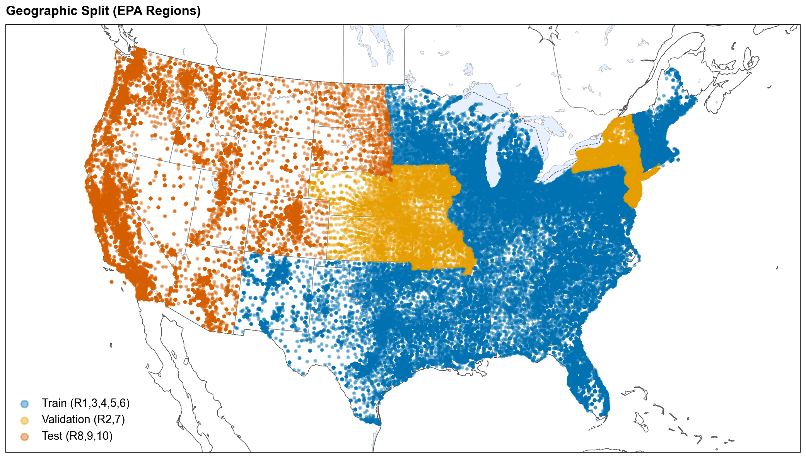
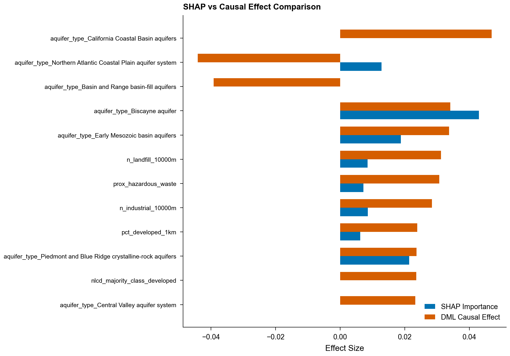
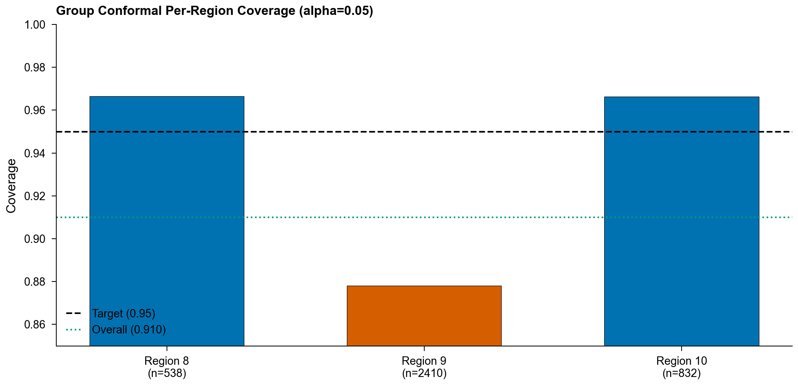
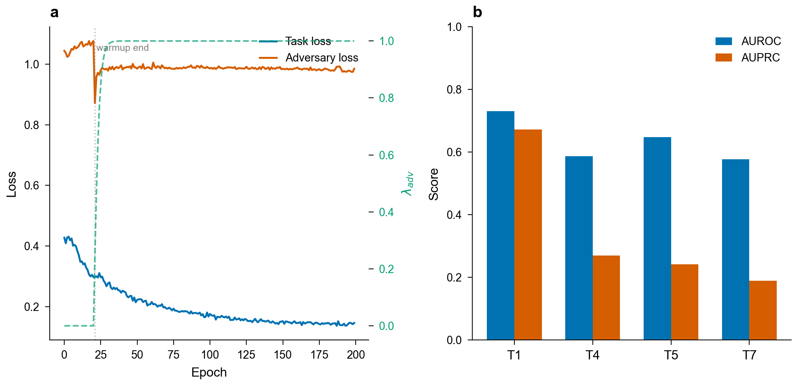
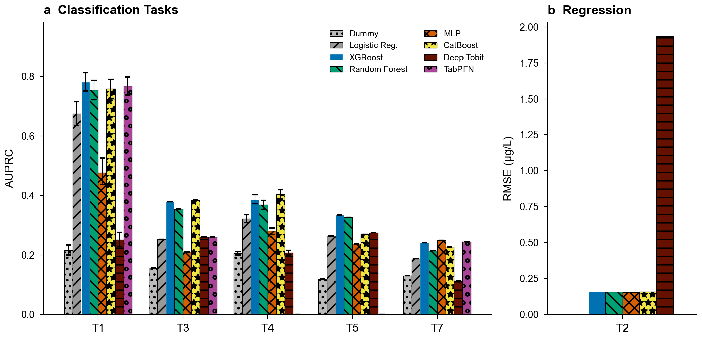

# Extended Data

## Extended Data Figures

### Extended Data Fig. 1: Geographic split map (EPA regions by train/val/test)

Map of the contiguous United States showing the geographic stratification used
for all benchmark tasks. The 10 EPA regions are partitioned into training
(Regions 1, 3, 4, 5, 6; blue), validation (Regions 2, 7; amber), and test
(Regions 8, 9, 10; orange) sets, maintaining a 60/15/25 ratio. Split
membership is derived from the PWSID state prefix. <!--pn:misgeo_flagged-->1,818<!--/pn--> systems are excluded
from this map only, not from the benchmark: their
geocoded coordinate falls inside a state belonging to a different EPA region
than their PWSID prefix, which marks a wrong-ZIP geocoding artifact when judged
against US Census state boundary polygons (Supplementary S7b).

### Extended Data Fig. 2: SHAP vs DML adjusted association comparison

Horizontal twin-bar chart comparing SHAP importance (correlational) and DML
adjusted effects (standardized, per 1-s.d.) for the top 12 features in the T1
XGBoost model. The aggregate rank correlation between DML-adjusted and
correlational feature rankings is modest but significant (Spearman ρ = <!--pn:dml_spearman_rho-->0.24<!--/pn-->,
p = <!--pn:dml_spearman_p-->0.032<!--/pn-->, n = <!--pn:dml_spearman_n-->80<!--/pn-->), and a grouped permutation test finds no feature category
displacing more than chance (Supplementary S14). Individual features
nonetheless reorder substantially: <!--pn:dml_sig_count-->69<!--/pn--> of <!--pn:dml_total-->130<!--/pn--> FDR-corrected DML coefficients
are significant, and the largest displacements are environmental rather than
demographic (`pct_wetland_5km` falls <!--pn:dml_wetland_disp-->48<!--/pn--> positions). Among demographics,
`pct_less_hs_education` and `pct_people_of_color` both retain significant
adjusted associations once monitoring confounders are adjusted for (education
SHAP rank <!--pn:dml_edu_shap-->76<!--/pn--> → DML rank <!--pn:dml_edu_dml-->39<!--/pn-->; people-of-color standardized
+<!--pn:dml_poc_effect-->0.022<!--/pn--> per 1-s.d., p_FDR < 0.001), whereas `pct_low_income` does not
(p_FDR = <!--pn:dml_income_pfdr-->0.54<!--/pn-->), consistent with its correlational signal being largely
monitoring-mediated. Monitoring intensity shows the opposite pattern: high SHAP
but smaller adjusted effects, consistent with confounding. Industrial-proximity
and Superfund-proximity features retain the strongest adjusted effects
(p_FDR < 0.001), with airport, landfill, and WWTP distances also significant
(p_FDR < 0.05), supporting mechanistic relevance.

### Extended Data Fig. 3: Conformal prediction per-region coverage

Per-EPA-region coverage of split conformal prediction sets at α = 0.05
(target 95%). Marginal coverage over the pooled test set is <!--pn:conf_marginal-->0.910<!--/pn-->; per-region
coverage varies from <!--pn:conf_r9-->0.878<!--/pn--> (Region 9, n = <!--pn:conf_n_r9-->2,410<!--/pn-->) to <!--pn:conf_rmax-->0.967<!--/pn--> (Region 8,
n = <!--pn:conf_n_r8-->538<!--/pn-->). Because calibration data come from the validation regions, coverage
is guaranteed only marginally; per-region distribution-free guarantees are
not claimed, and Region 9 under-covers at every significance level examined
(Supplementary S6).

### Extended Data Fig. 4: ICP training dynamics and metrics

**a**, Training dynamics of the Invariant Contamination Predictor showing task
loss, adversary (monitoring-head) loss, and the λ_adv schedule over epochs. This
is the training trace of the T1 ICP run captured through the canonical pipeline
(seed 42); the same run reproduces the panel-b test AUROC, so panel a is the
training history of the panel-b model rather than a separate re-fit. Task
loss decreases steadily. After the warmup period λ_adv ramps to its maximum and
the adversary's monitoring-prediction loss remains high and approximately flat,
indicating the representation does not encode the targeted confounders. A
held-out probe confirms that data-source provenance is also suppressed
(Supplementary S17). **b**, ICP classification performance (AUROC, AUPRC) across
benchmark tasks (T1 AUROC <!--pn:t1_icp_auroc-->0.731<!--/pn-->). See Table 3 for the full monitoring-invariance
decomposition.

### Extended Data Fig. 5: Benchmark performance overview

Test-set AUROC and AUPRC for the condensed model set on T1 (PFAS detection)
and T4 (lead action-level exceedance) under geographic stratification, with
95% bootstrap confidence intervals. Companion visualization to Table 2; T4's
nominally strong performance is monitoring-confounded (see Fig. 2 and
Table 3).

## Extended Data Tables

### Extended Data Table 1: Feature category ablation results

Drop-one-category ablation study for T1 (PFAS detection) and T4 (heavy
metal action level) using XGBoost with train-only imputation. For each
feature category, the number of features removed, baseline and ablated
AUPRC, performance delta, and paired bootstrap p-value with
Benjamini-Hochberg FDR correction (n = 1,000; T4 uses concatenated LORO
out-of-fold predictions) are reported. On the small T1 geographic test set the
monitoring-intensity ablation reduces AUPRC on both tasks, with a
substantially larger and more robust effect for T4 once
a target-leakage artifact inflating the T4 baseline is removed.

*See `paper/tables/table_ext3_ablation.csv` for full results.*

### Extended Data Table 2: Equity analysis summary

Environmental justice burden ratios across three evaluable demographic
dimensions (percent people of color, percent low income, education
attainment). Linguistic isolation was excluded because no test-set systems
fell below the 50th percentile (an empty reference group precludes burden
ratio computation). The PFAS detection burden ratio along
percent-people-of-color is <!--pn:ej_burden_test-->1.88<!--/pn--> in the geographically stratified test set
(EPA Regions 8, 9, 10; n_high = <!--pn:ej_n_high-->618<!--/pn-->, n_ref = <!--pn:ej_n_low-->1,544<!--/pn-->). Across the test
set, inverse-propensity-of-monitoring weighting attenuates the people-of-color
burden from <!--pn:ej_burden_test-->1.88<!--/pn--> to <!--pn:ej_burden_test_ipw-->1.62<!--/pn--> (still significant, permutation
p < 0.001), so the disparity is not an ascertainment artifact; the
LORO-weighted national mean is <!--pn:ej_burden_natl-->1.48<!--/pn--> (Supplementary Table 20). Permutation
test p-values with Benjamini-Hochberg FDR correction. Per-group AUROC is
similar across groups (<!--pn:ej_auroc_high-->0.799<!--/pn--> high-burden vs
<!--pn:ej_auroc_low-->0.750<!--/pn--> reference).

*See `paper/tables/table_ext4_equity_summary.csv` for full results.*

### Extended Data Table 3: Literature comparison

Comparison of AquaContam (XGBoost, controlled configuration) with prior ML
studies for water contamination prediction. Prior studies report high AUROC
under random cross-validation without geographic holdout. In our
controlled comparison the same XGBoost configuration (baseline feature set)
yields AUROC <!--pn:leak_random_auroc-->0.869<!--/pn--> under random splitting and <!--pn:leak_geo_auroc-->0.699<!--/pn--> under geographic
stratification. A size-matched random control (training
set subsampled to the geographic training-set size) reproduces the
random-split result, so the drop reflects the evaluation
protocol rather than model, feature, or training-set-size differences.

*See `paper/tables/table_ext5_literature_comparison.csv` for full results.*

### Extended Data Table 4: Random versus geographic split comparison

Controlled three-model × three-feature-set comparison (XGBoost, Random Forest,
Logistic Regression × baseline, literature-equivalent, and full feature
sets; 14,405 systems) of performance under random versus geographically
stratified splits for T1 (PFAS detection). AUPRC inflation under random
splitting reaches up to <!--pn:leak_lr_delta_pct-->58<!--/pn-->%, largest for logistic regression with the
full feature set (<!--pn:leak_lr_random_auprc-->0.723<!--/pn--> random vs <!--pn:leak_lr_geo_auprc-->0.457<!--/pn--> geographic); the benchmark
XGBoost/baseline cell inflates by <!--pn:leak_gbm_delta_pct-->40<!--/pn-->% (<!--pn:leak_random_auprc-->0.744<!--/pn--> vs <!--pn:leak_geo_auprc-->0.532<!--/pn-->). A size-matched
random control preserves inflation of a similar magnitude (Supplementary Table 1), ruling
out training-set size as the driver. The DeLong column reports a paired test of
Full-feature versus Baseline-feature AUROC on the shared geographic test set,
shown on the geographic/Full rows, together with the signed difference
(ΔAUROC = Full minus Baseline). That difference is negative for logistic
regression, whose Full-feature model performs significantly worse.

*See `paper/tables/table_brennan_comparison.csv` for full results.*

### Extended Data Table 5: Cross-source and geographic external validation

T1 (PFAS detection) model performance evaluated on independent state
databases. The fitted XGBoost model (trained on UCMR5/UCMR3 with geographic
stratification) is applied to each state database separately. 95% bootstrap
CIs (1,000 iterations) are reported for AUROC. For states whose EPA region
overlaps the training set, overlapping PWSIDs are excluded.

**Panel A: Cross-source validation** (independent PWS databases within validation-region geography):

| State DB | EPA Region | Split Role | n Systems | AUROC [95% CI] | AUPRC | Detection Rate |
|----------|-----------|------------|-----------|----------------|-------|----------------|
| NJ DEP | R2 | val | <!--pn:nj_ext_n-->1,310<!--/pn--> | <!--pn:nj_ext_auroc-->0.789<!--/pn--> [<!--pn:nj_ext_ci_lo-->0.765<!--/pn-->-<!--pn:nj_ext_ci_hi-->0.812<!--/pn-->] | <!--pn:nj_ext_auprc-->0.792<!--/pn--> | <!--pn:nj_ext_det-->0.473<!--/pn--> |
| MO DNR | R7 | val | <!--pn:mo_ext_n-->1,208<!--/pn--> | <!--pn:mo_ext_auroc-->0.829<!--/pn--> [<!--pn:mo_ext_ci_lo-->0.767<!--/pn-->-<!--pn:mo_ext_ci_hi-->0.885<!--/pn-->] | <!--pn:mo_ext_auprc-->0.281<!--/pn--> | <!--pn:mo_ext_det-->0.052<!--/pn--> |

**Panel B: Geographic external validation** (test-region geography, non-PWS monitoring domain):

| State DB | EPA Region | Split Role | n Systems | AUROC [95% CI] | AUPRC | Detection Rate |
|----------|-----------|------------|-----------|----------------|-------|----------------|
| CA GeoTracker | R9 | test | <!--pn:ca_ext_n-->1,421<!--/pn--> | <!--pn:ca_ext_auroc-->0.813<!--/pn--> | <!--pn:ca_ext_auprc-->0.707<!--/pn--> | <!--pn:ca_ext_det-->0.297<!--/pn--> |

†On the larger external sample the model performs above chance (DeLong test vs.
AUROC = 0.5: p < 0.001).

**Panel C: Detection-only databases** (single-class data precludes AUROC).
Two detection-only sources are retained for validation (MI MPART, WA DOH);
Ohio EPA is excluded because its PWSIDs overlap SDWIS, and NC DEQ provides no
usable records:

| State DB | EPA Region | Split Role | n Systems | AUROC | AUPRC | Detection Rate |
|----------|-----------|------------|-----------|-------|-------|----------------|
| MI MPART | R5 | train | 153 | — | — | 100% (single-class) |
| WA DOH | R10 | test | 256 | — | — | 100% (single-class) |
| OH EPA | R5 | — | — | — | — | Excluded (SDWIS PWSID overlap) |
| NC DEQ | R4 | — | — | — | — | Unavailable |
