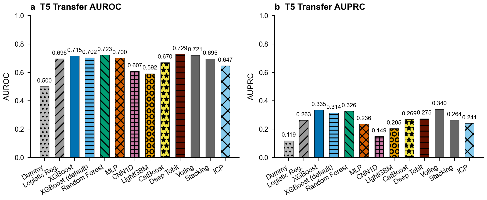
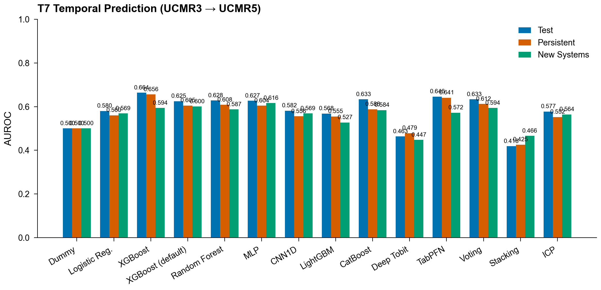
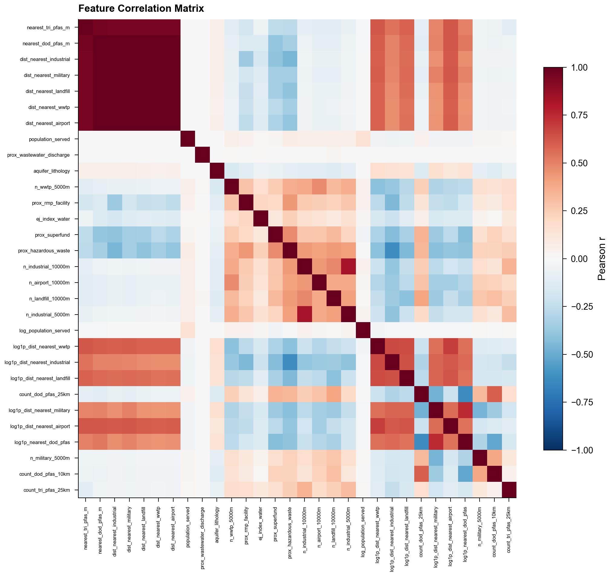
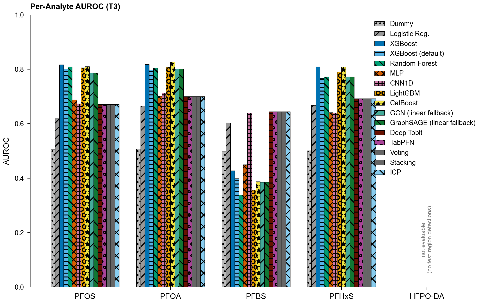
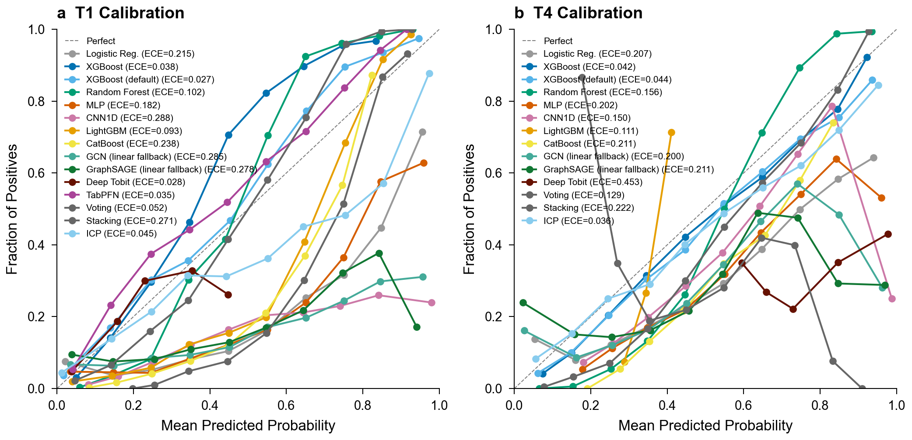
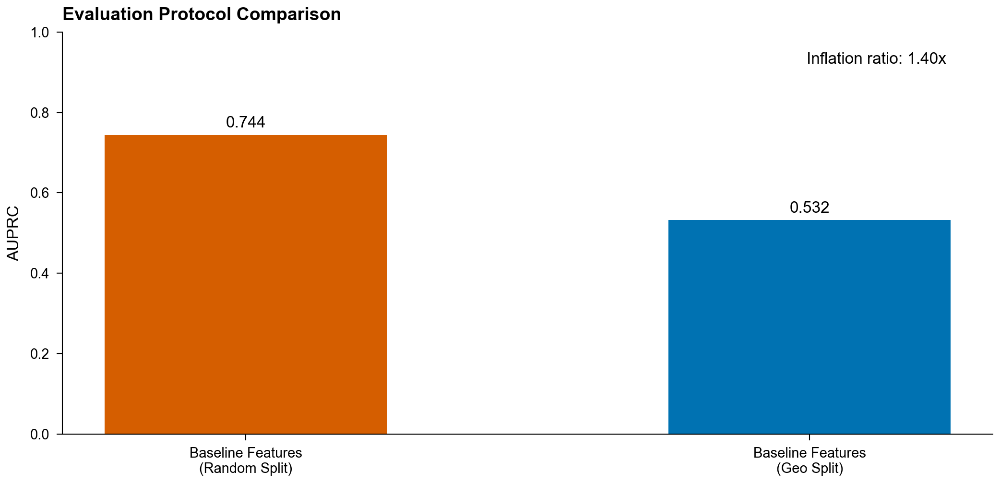
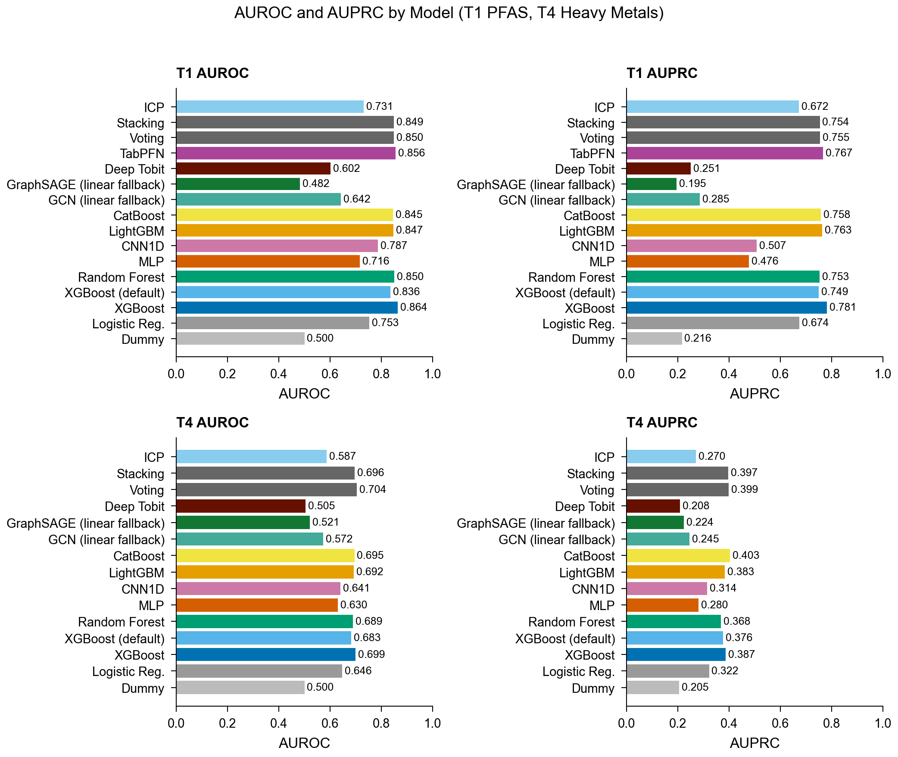
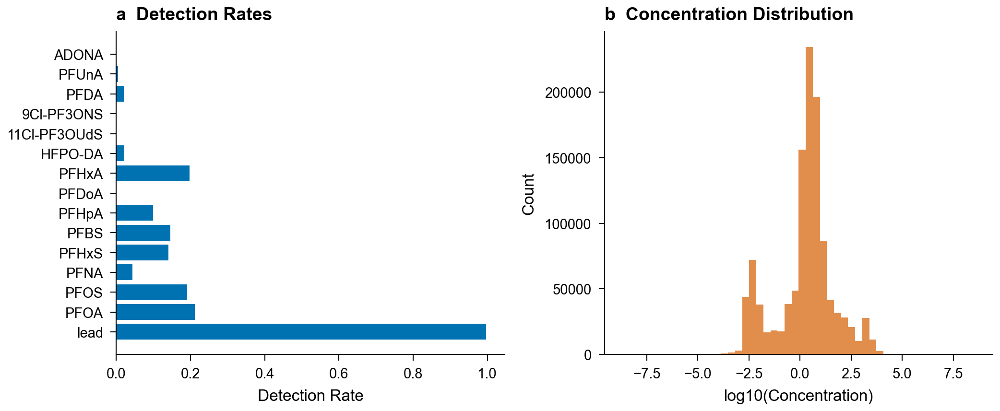
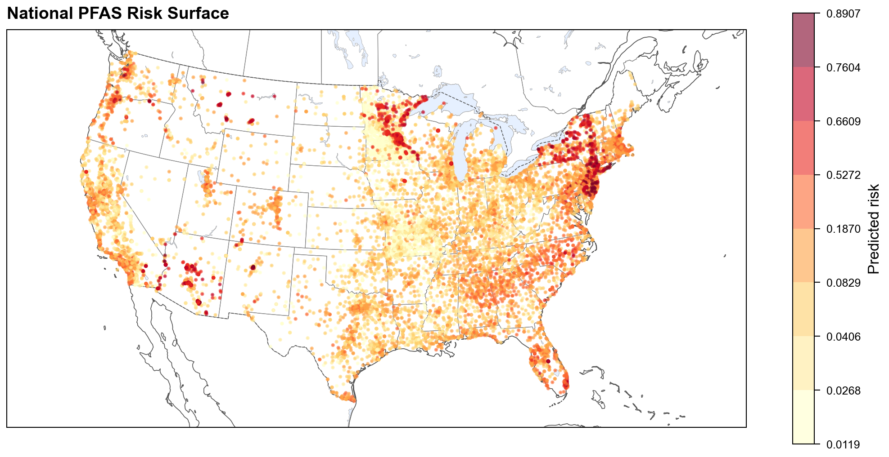

# Supplementary Information

## S1: Data Source Details

### UCMR5 (Unregulated Contaminant Monitoring Rule, 5th cycle)

- **Period**: 2023
- **Samples**: <!--pn:ds_ucmr5-->1,928,117<!--/pn--> analytical results
- **Analytes**: 29 PFAS compounds + lithium (30 total)
- **Censoring**: <!--pn:cens_ucmr5-->97.1<!--/pn-->% of results are non-detect (left-censored)
- **Source**: EPA UCMR5 occurrence data (https://www.epa.gov/dwucmr/occurrence-data-unregulated-contaminant-monitoring-rule)
- **Encoding**: Latin-1 (facility names contain accented characters)

### UCMR3 (Unregulated Contaminant Monitoring Rule, 3rd cycle)

- **Period**: 2013-2015
- **Samples**: <!--pn:ds_ucmr3-->1,069,174<!--/pn--> analytical results
- **Analytes**: 38 contaminants including 6 PFAS (PFOS, PFOA, PFBS, PFHxS, PFHpA, PFNA)
- **Censoring**: <!--pn:cens_ucmr3-->76.4<!--/pn-->% non-detect
- **Source**: EPA UCMR3 occurrence data

### SDWIS (Safe Drinking Water Information System)

- **Systems**: ~150,000 public water systems
- **Analytes**: Lead, copper (from Lead and Copper Rule sampling)
- **Source**: EPA ECHO SDWIS downloads

### EPA FRS (Facility Registry Service)

- **Facilities**: 40,828 PFAS-related facility sites
- **Classification**: SIC/NAICS codes + interest types (industrial, military, WWTP, airport, landfill)
- **Source**: EPA FRS national downloads

### State Databases

| State | Source | Analytes | Format |
|-------|--------|----------|--------|
| Michigan | MPART (ArcGIS REST) | 5 PFAS | JSON/API |
| California | GeoTracker GAMA | 29 PFAS | CSV |
| Ohio | EPA (ArcGIS REST) | 6 PFAS | JSON/API |
| Washington | DOH | 14 PFAS | CSV |
| Missouri | DNR (ArcGIS REST) | 29 PFAS | JSON/API |
| New Jersey | DEP (waterviewer REST) | 25 PFAS | JSON/API |
| North Carolina | DEQ | GenX + 5 PFAS | Excel/CSV |
| Minnesota | MDH (manual bulk export) | 27 PFAS | Excel |

Minnesota MDH is a manually provided bulk export (no public API; see
`docs/data_requests/`), parsed to <!--pn:ds_mn_mdh-->247,230<!--/pn--> measurements across <!--pn:mn_systems-->1,357<!--/pn--> public water
systems (2005--2026, ~92% non-detect by substitution at the reporting limit). It
enters the in-split benchmark population as a public-water-system compliance
source. As an independent corroboration of the ascertainment confound, among the
<!--pn:mn_overlap-->194<!--/pn--> Minnesota systems sampled for PFOS by both the federal UCMR cycles and MDH,
<!--pn:mn_flip-->19<!--/pn--> of the <!--pn:mn_ucmr_nd-->180<!--/pn--> (<!--pn:mn_flip_rate-->10.6<!--/pn-->%) that UCMR recorded as non-detect are detected once MDH's
independent, longer-window monitoring is included. This is direct evidence that measured
detection tracks who and how much a system is monitored, not only the underlying
environment.

### WQP (USGS/EPA Water Quality Portal)

- **Records**: <!--pn:ds_wqp-->35,528<!--/pn--> valid PFAS monitoring results
- **Analytes**: 13 PFAS compounds across 49 CONUS states
- **Censoring**: <!--pn:cens_wqp-->38.7<!--/pn-->% non-detect
- **Source**: USGS/EPA Water Quality Portal REST API (https://www.waterqualitydata.us/)
- **Notes**: Monitoring locations are not public water systems; synthetic WQP_ identifiers used. API batches queries in groups of three characteristicName values.
- **Cross-source diagnostic**: applying the T1 model to WQP as an out-of-sample check
  yields a pooled AUROC of <!--pn:wqp_pooled_auroc-->0.42<!--/pn-->, below chance. This is a Simpson's-paradox
  artifact of pooling regions with very different detection base rates (four of five
  per-region AUROCs are above chance); it is a fair-transfer failure for ambient,
  non-PWS data rather than a model defect, and no reader-facing claim rests on it. Like
  the CA GeoTracker ambient result, it reinforces that geographic generalization to
  ambient sources remains undemonstrated.

### TRI (Toxics Release Inventory)

- **Purpose**: PFAS release quantities from reporting industrial facilities
- **Source**: EPA TRI downloads (https://www.epa.gov/toxics-release-inventory-tri-program)
- **Usage**: Auxiliary data source for proximity feature engineering (facility distance/density)

### DoD PFAS Sites

- **Sites**: 761 federal sites (724 DoD/military) with known or suspected PFAS contamination
- **Source**: EPA PFAS Analytic Tools database
- **Usage**: Auxiliary data source for proximity feature engineering (military installation distance)

### Geospatial Data

| Dataset | Source | Resolution | Purpose |
|---------|--------|------------|---------|
| NLCD 2021 | USGS MRLC | 30 m | Land use fractions |
| EJScreen | EPA (Zenodo archive) | Block group | Demographics |
| Principal Aquifers | USGS | Polygon | Hydrogeology |
| Census ZCTA | US Census Bureau | ZCTA | Geocoding |

## S2: Hyperparameter Configurations

All model hyperparameters are specified in `configs/experiment.yaml`. Default
configurations used for all benchmark results:

### XGBoost Classifier
```yaml
n_estimators: 500
max_depth: 6
learning_rate: 0.05
subsample: 0.8
colsample_bytree: 0.8
min_child_weight: 5
scale_pos_weight: auto  # computed from class ratio
early_stopping_rounds: 50
eval_metric: aucpr
```

### Random Forest Classifier
```yaml
n_estimators: 500
max_features: sqrt
max_depth: null  # unlimited
min_samples_leaf: 5
class_weight: balanced
```

### LightGBM Classifier
```yaml
n_estimators: 500
num_leaves: 63
learning_rate: 0.05
subsample: 0.8
colsample_bytree: 0.8
min_child_samples: 20
is_unbalance: true
early_stopping_rounds: 50
```

### CatBoost Classifier
```yaml
iterations: 500
depth: 6
learning_rate: 0.05
auto_class_weights: Balanced
early_stopping_rounds: 50
```

### MLP Classifier
```yaml
hidden_sizes: [128, 64, 32]
dropout: 0.3
learning_rate: 0.001
epochs: 200
batch_size: 256
patience: 20
```

### Voting Ensemble
```yaml
voting: soft
base_models: [xgboost, random_forest, lightgbm, catboost]
```

### Stacking Ensemble
```yaml
final_estimator: logistic  # LogisticRegression meta-learner
cv: 5
base_models: [xgboost, random_forest, lightgbm, catboost]
```

### Symmetric Tuning Grids

Each model family receives symmetric hyperparameter tuning effort:

| Model | Parameters Tuned | Grid Size |
|-------|-----------------|-----------|
| XGBoost | max_depth, learning_rate, n_estimators | 18 |
| Random Forest | n_estimators, max_depth, max_features | 12 |
| LightGBM | num_leaves, learning_rate, n_estimators | 18 |
| CatBoost | depth, learning_rate, iterations | 18 |
| MLP | hidden_sizes, learning_rate, dropout | 18 |
| CNN1D | n_filters, learning_rate, dropout | 18 |

## S3: Optuna Convergence Results

Bayesian hyperparameter optimization using Optuna Tree-Parzen Estimator (TPE)
sampler was run for 50 trials per model family (XGBoost, Random Forest, LightGBM,
CatBoost, MLP, CNN1D) on the T1 PFAS detection task. Results are saved to
`results/optuna_tuning.json`.

The Optuna search spaces use broader ranges than grid search, enabling
exploration of regions that grid search may miss. Key findings:

- Optuna trials converge within ~30 trials for tree-based models
- Final AUPRC improvements over grid search are typically modest (< 0.01)
- The TPE sampler with seed=42 ensures reproducibility

## S4: CNN1D Feature Ordering Sensitivity

The CNN1D architecture treats tabular features as a 1D signal, applying
convolutional filters across adjacent features. Since feature ordering is
arbitrary in tabular data, we conducted a sensitivity analysis with seven
orderings: alphabetical, domain-grouped (proximity → land use →
hydrogeology → demographics), and five random permutations.

Results show that CNN1D performance is sensitive to feature ordering
(AUROC mean <!--pn:cnn1d_auroc_mean-->0.758<!--/pn--> ± <!--pn:cnn1d_auroc_std-->0.022<!--/pn-->; AUPRC mean <!--pn:cnn1d_auprc_mean-->0.566<!--/pn--> ± <!--pn:cnn1d_auprc_std-->0.046<!--/pn-->).
Alphabetical ordering achieves the highest AUROC (<!--pn:cnn1d_alpha_auroc-->0.794<!--/pn-->), ahead of
domain-grouped (<!--pn:cnn1d_domain_auroc-->0.776<!--/pn-->), with random orderings lower. This sensitivity confirms that
convolutional architectures are not ideal for unstructured tabular data,
and supports the benchmark result that tree-based models consistently
outperform deep learning on AquaContam tasks.

## S5: Model Calibration Details

We evaluate model calibration using Expected Calibration Error (ECE), Brier
score, and reliability diagrams, then apply post-hoc calibration (isotonic
regression, Platt scaling, and temperature scaling) to improve probability
estimates. Pre-calibration ECE varies substantially across models: CNN1D
exhibits the highest miscalibration (ECE = <!--pn:calib_ece_cnn1d-->0.288<!--/pn-->); the better-calibrated end includes CatBoost
(<!--pn:calib_ece_catboost-->0.238<!--/pn-->) and Logistic Regression (<!--pn:calib_ece_logreg-->0.215<!--/pn-->). Among tree-based models, Random
Forest (<!--pn:calib_ece_rf-->0.102<!--/pn-->), LightGBM (<!--pn:calib_ece_lgbm-->0.093<!--/pn-->), and XGBoost (<!--pn:calib_ece_xgb-->0.038<!--/pn-->) are better calibrated,
and XGBoost is the best-calibrated tree model out of the box; TabPFN is
comparable (ECE = <!--pn:calib_ece_tabpfn-->0.035<!--/pn-->). Post-hoc calibration (isotonic regression) can
further reduce ECE for miscalibrated models. We recommend isotonic regression
for deployment. Pre-calibration reliability diagrams for T1 and T4 are shown in
Supplementary Fig. 5.

## S6: Conformal Prediction Coverage

We applied split conformal prediction to the T1 and T4 classification tasks,
using the validation set for calibration and the test set for evaluation.
Conformal prediction sets at nominal coverage levels of 90% and 95% were
generated. At alpha = 0.05, XGBoost achieves empirical coverage of <!--pn:conf_xgb_cov-->0.949<!--/pn--> with
a mean prediction set size of <!--pn:conf_xgb_set-->1.291<!--/pn--> (out of 2 possible classes). At alpha =
0.10, per-model empirical coverage varies, with the linear model showing the
most pronounced undercoverage. Split conformal prediction provides finite-sample coverage guarantees under
the assumption that calibration and test data are exchangeable (i.e., drawn
i.i.d. from the same distribution). Our geographic stratification (using EPA
Regions 1, 3, 4, 5, 6 for training, 2, 7 for validation/calibration, and 8,
9, 10 for testing) partially violates this assumption, since calibration and
test regions are spatially disjoint with potentially different feature
distributions. However, three lines of evidence suggest this violation is
modest in practice: (1) the empirical marginal coverage (<!--pn:conf_marginal_cov-->0.910<!--/pn--> at α =
0.05, modestly below the 0.95 target) across the test set, (2) the per-region group conformal results below,
where most test regions cover near nominal but Region 9 (California) materially
under-covers (<!--pn:conf_r9-->0.878<!--/pn--> against the 0.95 target), and (3) the observation that PFAS contamination drivers
(proximity to industrial sites, hydrogeology, land use) are qualitatively
similar across US regions even if their distributions differ.
Under distribution shift conformal sets can become either conservative or
anti-conservative depending on the direction of the shift (Barber et al., 2023,
"Conformal prediction beyond exchangeability"). Empirically we observe modest
under-coverage rather than overcoverage, so we report these figures as observed
coverage, not a delivered guarantee; the prediction sets average <!--pn:conf_marginal_set-->1.328<!--/pn--> out of 2
possible classes. For applications requiring stricter guarantees under
covariate shift, weighted conformal methods could be applied using density
ratio estimation between calibration and test distributions.

Key findings:
- Empirical coverage closely matches nominal coverage (within a couple of percentage points) for all
  model families on T4
- T1 coverage is slightly below nominal for some models (e.g., CatBoost <!--pn:conf_catboost-->0.912<!--/pn-->,
  LightGBM <!--pn:conf_lgbm-->0.944<!--/pn--> at α = 0.05), likely due to the severe class imbalance
  (~29% positive rate) and finite calibration set size
- Conformal sets provide observed (approximate) coverage even for models
  with miscalibrated probability estimates

### Conformal Prediction Coverage

Split conformal prediction provides a **marginal** coverage guarantee over the
pooled test set. We report coverage broken out by EPA test region (8, 9, 10)
to expose subpopulation behavior, but emphasize that the guarantee is
marginal, not per-region: the calibration set comes from the validation
regions, so each test region has zero in-region calibration points
(`n_calibration = 0`) and the `reliable_guarantee` flag is `false` everywhere.
At α = 0.05 (target 95%):

| Region | Coverage | Avg Set Size | N |
|--------|----------|-------------|---|
| 8 | <!--pn:conf_rmax-->0.967<!--/pn--> | <!--pn:conf_s8-->1.398<!--/pn--> | <!--pn:conf_n_r8-->538<!--/pn--> |
| 9 | <!--pn:conf_r9-->0.878<!--/pn--> | <!--pn:conf_s9-->1.310<!--/pn--> | <!--pn:conf_n_r9-->2,410<!--/pn--> |
| 10 | <!--pn:conf_r10-->0.966<!--/pn--> | <!--pn:conf_s10-->1.334<!--/pn--> | <!--pn:conf_n_r10-->832<!--/pn--> |
| **Overall (marginal)** | **<!--pn:conf_marginal-->0.910<!--/pn-->** | **<!--pn:conf_marginal_set-->1.328<!--/pn-->** | **<!--pn:conf_marginal_n-->3,780<!--/pn-->** |

Region 9 (Pacific) under-covers (<!--pn:conf_r9-->0.878<!--/pn-->) at every significance level examined,
illustrating why per-region distribution-free guarantees cannot be claimed
without per-region calibration data. A true Mondrian (per-region) conformal
predictor would require carving a calibration slice from each test region,
which would change the headline test set; we therefore report marginal
coverage and flag the per-region variation rather than over-claiming a
regional guarantee.

## S7: Sensitivity Analysis

To assess robustness to preprocessing choices, we evaluate T1 (XGBoost)
across five NaN-drop thresholds (0.3, 0.4, 0.5, 0.6, 0.7; the fraction
of missing values above which a feature column is dropped before imputation)
and several proximity buffer-radius variants. All five thresholds produce an
identical <!--pn:sens_nfeat-->135<!--/pn-->-column feature set with identical performance (AUROC <!--pn:sens_auroc-->0.858<!--/pn-->,
AUPRC <!--pn:sens_auprc-->0.688<!--/pn-->): no feature column has a missingness fraction in the tested
range, so the threshold does not bind and the model is exactly invariant to
it. Restricting proximity features to a single buffer radius leaves
performance essentially unchanged, confirming the model
does not depend on any single radius choice.

### S7b: Coordinate Source Breakdown and Perturbation Sensitivity

Of the <!--pn:ds_systems-->95,223<!--/pn--> systems in the dataset, <!--pn:ds_geocoded-->87,450<!--/pn--> are geocoded, most via
ZCTA centroids and the remainder from original source coordinates. ZCTA
centroid geocoding introduces roughly 5 km of spatial imprecision for a
typical system.

To quantify the impact of this imprecision on model performance, we added
uniform random noise (1, 5, 10 km) to all system coordinates and re-ran
T1 XGBoost (5 seeds per perturbation level). Performance is robust: at 5-km
perturbation both AUROC and AUPRC are essentially unchanged, and proximity
features use 5–25 km buffers that are insensitive to small coordinate shifts
(see `paper/tables/table_coordinate_sensitivity.md`). Extending the perturbation to
the empirical error tail (`coordinate_tail_sensitivity.json`, magnitudes to 270 km,
the upper tail of the geocoding-error distribution) shows no monotone degradation: test
AUROC is <!--pn:coordtail_0km-->0.808<!--/pn--> unperturbed and <!--pn:coordtail_270km-->0.820<!--/pn--> at 270 km, flat within run-to-run
noise. The environmental-feature signal is therefore not an artifact of precise
coordinates: it survives tail-magnitude perturbation, so the measurement-precision
asymmetry between exact monitoring features and imprecise environmental features does
not, by itself, explain the environmental features' limited contribution.

The perturbation analyses above address random imprecision but not systematic
mislocation. For a subset of systems the harmonized coordinate derives from an
out-of-state mailing- or operator-address ZIP code, which places the system deep
inside a foreign EPA region. We flag every system whose PWSID-prefix EPA region
disagrees with its coordinate-derived region, judging each coordinate against US
Census cartographic state boundary polygons (a point maps to the state whose polygon
covers it, or to the nearest state within a 3.0-degree tolerance for water-jittered
centroids that no shoreline-clipped polygon covers): <!--pn:misgeo_flagged-->1,818<!--/pn--> of the
<!--pn:ds_geocoded-->87,450<!--/pn--> geocoded systems. The geographic split derives from the PWSID
prefix, not the coordinate, so split membership is unaffected; the exposure is
limited to wrong-place environmental features for the flagged systems, and these
systems are excluded from the Extended Data Fig. 1 split map. To bound the modeling
impact we re-ran the T1 and T4 XGBoost benchmarks on the canonical harness with all
flagged systems removed end to end (training and evaluation): T1 test AUROC moves
from <!--pn:t1_full_auroc-->0.864<!--/pn--> to <!--pn:misgeo_t1_excl_auroc-->0.866<!--/pn--> and T4 from
<!--pn:t4_full_auroc-->0.699<!--/pn--> to <!--pn:misgeo_t4_excl_auroc-->0.697<!--/pn--> (frozen
`misgeocode_sensitivity_v2.json`), so the headline results do not depend on the
mis-geocoded systems.

## S8: Evaluation Protocol Ablation

To quantify the impact of evaluation protocol on reported performance, we
compared random 5-fold cross-validation against geographic stratification
using a baseline proximity/demographic feature set comparable to those used
in prior PFAS prediction studies (Hu et al. 2016, Fernandez et al. 2023,
Tokranov et al. 2024).

Key findings:
- Under random CV, XGBoost achieves AUROC <!--pn:leak_random_auroc-->0.869<!--/pn--> on the baseline feature set;
  under geographic holdout, it drops to <!--pn:leak_geo_auroc-->0.699<!--/pn-->
- A size-matched random control, with each fold's training set
  stratified-subsampled to the geographic training-set size (n = 7,930),
  reproduces the random-CV result, so the gap is an
  evaluation-protocol effect, not a training-set-size effect
- The two evaluation sets differ in base rate (geographic test prevalence <!--pn:prev_geo_test-->0.285<!--/pn--> versus <!--pn:prev_random_folds-->0.215<!--/pn--> in the stratified random folds, pooled rate). The geographic set has the higher rate, so the prevalence asymmetry biases the AUPRC comparison against the leakage claim rather than inflating it. The prevalence-independent AUROC contrast is therefore the main-text headline (frozen `split_prevalence.json`)
  (Supplementary Table 1)
- The direction is consistent across all nine model × feature-set cells
  (Extended Data Table 4) on AUROC: the geographic split scores below random CV on
  AUROC in every cell (two logistic-regression cells reverse on AUPRC, a prevalence
  artifact that biases against the leakage claim), with AUPRC inflation of up to <!--pn:leak_lr_delta_pct-->58<!--/pn-->%

The full feature set × split strategy comparison is available in
`paper/tables/table_brennan_comparison.md`, and the random-versus-geographic
performance is shown in Supplementary Fig. 6.

### Supplementary Table 1: Size-matched random-split control

Random 5-fold CV with each fold's training set stratified-subsampled to the
geographic training-set size (n = 7,930), for all nine model × feature-set
cells of the split comparison. AUPRC inflation relative to the geographic
split persists with and without size matching, ruling out the
random arm's larger training set as the driver of the inflation.

*See `paper/tables/table_supp_split_sizematched.md` for full results.*

## S9: Spatial Autocorrelation

Moran's I test for spatial autocorrelation in model residuals was performed
using inverse-distance spatial weights over the k=10 nearest neighbors.
Significant positive autocorrelation (I > 0, p < 0.01) was detected in
residuals of all models on both T1 and T4, indicating that model errors are
spatially clustered. For the headline XGBoost T1 model, residual Moran's I is
<!--pn:spatial_xgb_50-->0.212<!--/pn--> at 50 km, declining to <!--pn:spatial_xgb_200-->0.077<!--/pn--> at 200 km; positive
autocorrelation is present across all models (`spatial_autocorrelation.json`).

This finding justifies the use of geographic stratification for train/test
splitting. It also means the i.i.d. bootstrap confidence intervals reported
elsewhere are approximate, because residual errors are not independent.

### Region-block bootstrap of the LORO headline

To check that the residual autocorrelation does not materially understate
uncertainty in the headline LORO estimate, we re-estimated the T1 XGBoost LORO
mean AUROC with a region-block bootstrap that resamples the ten EPA regions
(the spatial-clustering scale) with replacement, recomputing the
sample-size-weighted mean each iteration (10,000 iterations;
`spatial_block_bootstrap.json`). The block-bootstrap 95% interval is
[<!--pn:loro_full_ci_lo-->0.705<!--/pn-->, <!--pn:loro_full_ci_hi-->0.860<!--/pn-->], modestly wider than the naive across-fold normal
interval but qualitatively unchanged: the headline remains well above
chance. Accounting for spatial clustering widens the interval modestly rather
than overturning the result.

### Buffered-boundary leave-one-region-out

A related concern is that systems straddling EPA-region seams could leak
information across the held-out boundary. We re-ran the LORO sweep over all 10 EPA regions after
excluding every training system within 50 km (EPSG:5070) of the held-out region
(829–1,685 systems excluded per fold; `loro_cv_buffered.json`), with imputation
aligned to the primary train-only path (an earlier three-region variant of this
check imputed on the full dataset before subsetting and is superseded).
Buffering reduces the unweighted provenance-reduced LORO mean modestly, from <!--pn:loro_pf_fold_mean_ref-->0.694<!--/pn-->
to <!--pn:buff_pf_mean-->0.661<!--/pn--> (with-provenance <!--pn:buff_full_mean-->0.752<!--/pn-->), far from collapsing it: region-seam
proximity contributes marginally to the estimate but does not drive the
transportable signal.

## S10: Software Versions

All experiments were run with the following software stack. Exact versions
are recorded in `results/software_versions.json` during each pipeline run.

| Package | Version |
|---------|---------|
| Python | 3.10+ |
| NumPy | 1.24+ |
| pandas | 2.0+ |
| scikit-learn | 1.3+ |
| XGBoost | 2.0+ |
| LightGBM | 4.0+ |
| CatBoost | 1.2+ |
| PyTorch | 2.4+ |
| GeoPandas | 0.14+ |
| SHAP | 0.44+ |
| Optuna | 3.4+ |

Full environment specification: `environment.yml` (conda) and `pyproject.toml` (pip).

## S11: Multi-Seed Stability Analysis

To verify that benchmark results are not artifacts of a single random seed,
we evaluated T1 (PFAS detection) and T4 (heavy metal prediction) across five
random seeds (42, 123, 456, 789, 2024) with three model families: XGBoost,
CatBoost, and Logistic Regression. Each seed controls random initialization
of model training and bootstrap sampling. For tree-based models, the training
set size (7,930 systems for T1, 51,283 systems for T4) is sufficiently large that
stochastic variation is minimal.

Results confirm moderate stability for T1 and high stability for T4. For T1,
AUROC standard deviation across seeds is <!--pn:mss_t1_xgb_auroc_sd-->0.003<!--/pn--> (XGBoost) and <!--pn:mss_t1_cat_auroc_sd-->0.005<!--/pn--> (CatBoost);
for T4, standard deviation is negligible for all models. AUPRC standard
deviation is likewise small, with T1 CatBoost at <!--pn:mss_t1_cat_auprc_sd-->0.006<!--/pn-->. Logistic
Regression is fully deterministic (zero variance).
The full seed-by-seed results are saved to `results/multi_seed_stability.json`.

### Seed Inflation Check

To assess whether reporting a single seed (seed=42) inflates metrics relative
to the multi-seed distribution, we computed z-scores: z = (reported − mean) / std
for each task/model. The reported seed-42 headline metrics (Table 2) come from
the full benchmark pipeline, whereas the multi-seed distribution is produced by
a streamlined single-model stability harness. After correcting a region-
assignment defect that had caused the two paths to evaluate different test
populations (Methods; ~605 geocoded systems were previously dropped from the
streamlined harness), the streamlined single-model harness runs modestly
*below* the full benchmark rather than above it, so it does not inflate
reported skill: for both T1 XGBoost and CatBoost the streamlined single-model
harness runs modestly below the full benchmark (the streamlined harness omits
the ensemble averaging and part of the feature set). Because the paper's honest
out-of-region headline (LORO) uses XGBoost within a single harness, this
cross-harness difference does not affect it.
*Within* a fixed harness, seed-to-seed variability is small: the maximum
across-seed optimism for any single model is <!--pn:seed_max_optimism-->0.005<!--/pn--> AUROC. T4 is
near-deterministic across seeds, and Logistic Regression is fully
deterministic. Full results are in
`results/seed_inflation_check.json`.

### Default-Hyperparameter Stability

Table 2 in the main text reports default (non-tuned) configurations at seed 42
for reproducibility; this subsection characterizes variability under those
default configurations across seeds.

For T1, XGBoost and CatBoost show small across-seed AUROC s.d.,
confirming that seed-to-seed variability within a fixed harness is modest
compared to the much larger differences between top tree models and neural
networks. For T4,
variability is negligible for all models, reflecting the stronger
and more consistent signal in heavy metal prediction.

### Supplementary Table 2: Multi-seed stability

*See `paper/tables/table_supp_multi_seed.csv` for per-model, per-task mean
+/- SD across five seeds.*

## S12: Per-Region Heterogeneity Analysis

LORO cross-validation reveals substantial variation in per-region AUROC for T1.
To understand the sources of this heterogeneity, we
analyzed per-region PFAS detection rates, feature distributions, and missing
data patterns.

Region 4 (Southeast) underperforms with the lowest LORO AUROC, while
Region 3 (Mid-Atlantic) is the strongest mainland region.
Kolmogorov-Smirnov tests on the top SHAP features show significant
distributional shifts between these best- and worst-performing regions for
wetland fraction (KS = <!--pn:reghet_wetland_ks-->0.308<!--/pn-->, FDR p < 0.001) and
monitoring intensity (n_samples; KS = <!--pn:reghet_nsamples_ks-->0.065<!--/pn-->,
FDR p < 0.05); the data-source missingness indicators do not differ
significantly. Region 4 also has higher missing rates for hydrogeological
features due to sparser aquifer mapping coverage, reducing the discriminative
signal available to environmental features.

These findings imply that practitioners deploying AquaContam models should
expect lower performance in regions with fewer industrial contamination sources
and should consider region-specific calibration. Full results are in
`results/region_heterogeneity.json`.

## S13: Deep Tobit Architecture

The Deep Tobit model is a censoring-aware neural network that explicitly
models left-censored observations common in water quality data. The
architecture is a 3-layer MLP (128-64-32 hidden units) with ReLU activations
and dropout (0.3), identical to the standard MLP baseline. The key difference
is the loss function: instead of binary cross-entropy, Deep Tobit uses a
Tobit likelihood loss:

*L = -Σ [d_i · log φ((y_i - μ_i)/σ) - d_i · log σ + (1-d_i) · log Φ((c_i - μ_i)/σ)]*

where d_i = 1 for detected (uncensored) samples, y_i is the observed
concentration, c_i is the detection limit, μ_i is the predicted mean, σ is
the learned noise scale, and φ/Φ are the standard normal PDF/CDF.

For binary classification tasks, the predicted latent concentration is
compared against the detection limit: P(detected) = 1 - Φ((c - μ)/σ). The
classification target is obtained by passing continuous concentration values
(not binary labels) to the Tobit loss via `_fit_extra` kwargs, so the network
learns the true concentration surface and derives detection probability from
it. This yields T1 AUROC <!--pn:dt_t1_auroc-->0.602<!--/pn--> (Table 2), well below the tree-based models,
indicating that the censoring-aware loss does not competitively transfer to
binary detection under the expanded dataset with geographic evaluation. The implementation includes gradient clipping, cosine
learning rate scheduling, clamped log-sigma, and numerically stable
truncated-mean prediction with asymptotic approximation for extreme
z-values. For regression (T2), a log1p transform stabilizes the heavily
skewed concentration distribution, and output clamping prevents overflow
in the inverse Mills ratio.
Despite modest T1 classification performance (AUROC <!--pn:dt_t1_auroc-->0.602<!--/pn-->), Deep Tobit
achieves a T5 transfer AUROC of <!--pn:dt_t5_auroc-->0.729<!--/pn-->, the highest of any model
family. The disconnect
between T1 and T5 performance suggests that the censoring-aware loss captures
some environmental signal relevant to cross-contaminant transfer, even when
within-domain binary classification degrades.

### S13b: Zero-Inflated Censored Regression Architectures

Three additional model families address the zero-inflated, left-censored
structure of T2 concentration data (97% censored). Each decomposes the
prediction problem differently, treating structural zeros and censored
observations as distinct phenomena.

**Hurdle (XGBoost two-part model).** A two-stage decomposition separating
the zero process from the positive-value process. Stage 1 (gate): an XGBoost
binary classifier estimates P(detected) trained on all systems. Stage 2
(intensity): an XGBoost regressor estimates E[Y | detected] trained only on
the ~3% detected subset, operating in log-space. The combined prediction is
E[Y] = P(detected) × E[Y | detected]. Back-transformation from log-space
uses the Duan (1983) smearing estimator to correct for retransformation bias,
computing the empirical mean of exponentiated training residuals as the
correction factor. This avoids the systematic underestimation inherent in
naïve exponentiation of log-scale predictions.

**XGBoost AFT (Accelerated Failure Time).** Uses XGBoost's native
`survival:aft` objective with interval-censored encoding to provide
statistically proper left-censoring treatment. Detected samples are encoded
as point observations [log1p(y), log1p(y)], while censored samples are
encoded as left-censored intervals [ε, log1p(DL)], where DL is the detection
limit and ε is a small positive constant. The model estimates the conditional
survival function S(t | X) via XGBoost's DMatrix `label_lower_bound` and
`label_upper_bound` interface. Point predictions are obtained from the
estimated log-normal location parameter. This approach respects the censoring
mechanism without imputation or substitution of non-detects.

**Zero-Inflated Deep Tobit (ZI-Tobit).** A deep neural network with three
output heads on a shared hidden trunk (two hidden layers, ReLU activations,
dropout, batch normalization). The gate head produces P(structural_zero) via
a sigmoid activation, distinguishing true zeros from censored observations.
The μ head estimates the latent mean concentration. The log-σ head estimates
the log-scale parameter with clamping for numerical stability. The loss
function is a zero-inflated Tobit negative log-likelihood:

*L = -Σ [z_i · log(π_i) + (1-z_i) · log(1-π_i) + (1-z_i) · L_Tobit(y_i, μ_i, σ_i)]*

where π_i = P(structural_zero), z_i indicates structural zeros, and L_Tobit
is the standard Tobit log-likelihood from S13. A log-sum-exp trick ensures
numerical stability when combining the zero-inflation and Tobit components.

**Hurdle+AFT Ensemble.** A simple average of the Hurdle and XGBoost AFT
predictions, combining the two-part decomposition with the survival-based
approach. This ensemble provides a complementary aggregation of structurally
different censoring treatments without additional hyperparameter tuning.

## S14: DML Adjusted Association Methodology and Results

To move beyond correlational feature importance (SHAP) toward adjusted
estimates, we apply double machine learning (DML) to estimate the adjusted
effect of each feature on PFAS detection probability, controlling for a
pre-specified set of monitoring and system-size confounders (monitoring intensity
n_samples, population served, log population served, and mean detection limit).

### Algorithm

For each feature X_j:

1. **Cross-fitting**: Split data into K=5 folds (pooled `KFold(shuffle=False)`, used
   only to avoid own-fold overfitting in the nuisance step, not as a generalization split)
2. **Nuisance estimation**: In each fold, train gradient-boosted models to
   predict (a) the outcome Y from the confounder set W, and (b) X_j from W
3. **Residualize**: Compute residuals Ỹ = Y - E[Y|W] and X̃_j = X_j - E[X_j|W]
4. **Adjusted estimate**: Regress Ỹ on X̃_j; the coefficient is the
   partially-linear DML estimate of X_j's association net of W

This procedure removes confounding from the monitoring/size confounder set W, yielding
the association of X_j net of monitoring intensity rather than net of all other features
(the estimand is "adjusted for monitoring", which is what the code residualizes against).

### Key Results

- **Adjusted AUROC**: <!--pn:dml_adjusted_auroc-->0.729<!--/pn--> (vs. original <!--pn:dml_original_auroc-->0.835<!--/pn-->); ~13% of discrimination
  from feature confounding. Both are computed under the pooled 5-fold cross-fitting above,
  not the geographic holdout, so <!--pn:dml_original_auroc-->0.835<!--/pn--> is an in-sample pooled value
  distinct from the <!--pn:t1_full_auroc-->0.864<!--/pn--> geographic-split headline; the pair is a relative
  decomposition of the discrimination attributable to feature confounding, not a
  generalization estimate
- **Significant coefficients**: <!--pn:dml_sig_count-->69<!--/pn--> of <!--pn:dml_total-->130<!--/pn--> features are significant after
  Benjamini-Hochberg FDR correction (p_FDR < 0.05; <!--pn:dml_sig_p01-->59<!--/pn--> at p_FDR < 0.01)
- **First-stage strength**: the treatment-residualization nuisance model has a
  negative cross-fitted R² for <!--pn:dml_neg_r2_count-->109<!--/pn--> of <!--pn:dml_total-->130<!--/pn--> features (it predicts
  them worse than their mean), i.e. most features are near-orthogonal to the monitoring
  confounders. The adjustment therefore removes little for these features not because it
  is mis-specified but because there is little monitoring confounding to remove, which
  strengthens rather than weakens the reading that the retained environmental signal is
  not a monitoring artifact
- **Largest displacements are environmental**: `pct_wetland_5km` falls <!--pn:dml_wetland_disp-->48<!--/pn-->
  positions (of <!--pn:dml_spearman_n-->80<!--/pn--> ranked confounder-orthogonalized features)
- **Demographic features**: `pct_less_hs_education` is markedly upranked
  (SHAP rank <!--pn:dml_edu_shap-->76<!--/pn--> → DML rank <!--pn:dml_edu_dml-->39<!--/pn-->) and retains a significant adjusted
  association; `pct_people_of_color` also retains a significant adjusted
  association (standardized coefficient +<!--pn:dml_poc_effect-->0.022<!--/pn--> per 1-s.d., p_FDR < 0.001),
  whereas `pct_low_income` does not (p_FDR = <!--pn:dml_income_pfdr-->0.54<!--/pn-->), indicating its
  correlational signal is largely monitoring-mediated
- **Proximity features**: Industrial facility counts and Superfund proximity
  retain the strongest adjusted effects (p_FDR < 0.001); airport, landfill, and
  WWTP distances are also significant (p_FDR < 0.05), confirming mechanistic
  relevance
- **Monitoring intensity** (n_samples): SHAP importance rank 1, but smaller
  adjusted effect, consistent with confounding rather than direct causation

### Limitations

DML assumes a partially linear model and no unmeasured confounders, both
strong assumptions. Rare features (e.g., one-hot aquifer types with <100
systems) may yield unstable adjusted estimates. We report standard errors and
p-values to flag unreliable estimates. The adjusted AUROC should be
interpreted as a lower bound on genuine predictive signal.

### Supplementary Table 3: DML adjusted association results

Top 15 features ranked by absolute DML adjusted effect. For each feature, the
table reports SHAP importance (correlational), DML adjusted effect,
standard error, p-value, and feature ranks in each method. Socioeconomic
features show large rank displacements between DML and SHAP (e.g.,
`pct_less_hs_education` moves from SHAP rank <!--pn:dml_edu_shap-->76<!--/pn--> to DML rank <!--pn:dml_edu_dml-->39<!--/pn-->), indicating
genuine environmental risk pathways underattributed by correlational analysis. Original AUROC: <!--pn:dml_original_auroc-->0.835<!--/pn-->; adjusted AUROC: <!--pn:dml_adjusted_auroc-->0.729<!--/pn-->
(~13% of discrimination from feature confounding). Coefficients are
standardized (per 1 s.d.) so that rankings and sensitivity bounds are
scale-invariant.

*See `paper/tables/table_ext10_causal_deconfounding.csv` for full results.*

### Grouped Permutation Test for Category-Level Rank Displacements

The aggregate Spearman rank correlation between DML and SHAP is modest but
significant (ρ = <!--pn:dml_spearman_rho-->0.24<!--/pn-->, p = <!--pn:dml_spearman_p-->0.032<!--/pn-->), and we further tested whether individual
feature categories show significantly larger mean absolute rank displacements
than expected under random category assignment.

**Method.** For each of 5 feature categories (proximity n = 14, land use n = 22,
hydrogeology n = 13, demographics n = 5, and other n = 23), we computed the
observed mean absolute displacement (|SHAP rank − DML rank|). Monitoring
intensity and system characteristics features were not ranked because they serve
as confounders in the DML analysis and are orthogonalized out. We generated a
null distribution by permuting category labels across the ranked features
(10,000 permutations) and computing the same per-category mean. The one-sided
p-value is (count of null ≥ observed + 1) / (N + 1). P-values are
FDR-corrected across categories using Benjamini-Hochberg.

**Results.** No feature category reaches significance after FDR correction:
across the five categories (land use, demographics, proximity, hydrogeology,
and other), mean absolute rank displacements are modest and similar, and every
category's FDR-corrected permutation p-value is far from significance
(`dml_shap_rank_comparison.json`).

The non-significance reflects the small number of features per category
(especially demographics, n = 5) rather than the absence of category-level
patterns. With only five socioeconomic features, even a sizeable mean rank
displacement does not consistently exceed what random 5-feature subsets achieve
by chance. The evidence for socioeconomic rank elevation therefore rests on the
individual-feature FDR-corrected DML coefficients (<!--pn:dml_sig_count-->69<!--/pn-->/<!--pn:dml_total-->130<!--/pn--> significant) and the
significant aggregate correlation, not on category-level permutation tests.

*See `results/category_displacement_test.csv` for full results.*

### Spatially-aware permutation of the equity significance tests (M8b)

The headline monitoring-inequity ratios and the per-region burden significances were
originally assessed with i.i.d. label-shuffle permutations, which ignore spatial
autocorrelation and can be anti-conservative. We re-tested both under spatial nulls
(`spatial_permutation.json`, 10,000 permutations). For the national monitoring-intensity
ratios we permuted the demographic values only WITHIN EPA regions (stratified
permutation), removing the between-region component from the null; the people-of-color
sampling disparity (ratio <!--pn:mon_ratio_poc-->1.85<!--/pn-->x) remains significant, p < <!--pn:perm_poc_p_spatial-->0.001<!--/pn-->, and the
low-income under-sampling likewise persists. For the per-region burden significances,
because the frozen per-region burdens use held-out per-fold imputation that a single
global-imputation assembly does not reproduce exactly, we compared the naive label
shuffle against a spatial ROTATION null (circular shift over within-region k-means
spatial-cluster order) on ONE common assembly, a valid comparison of the two
permutation methods. On that assembly <!--pn:perm_reg_naive-->5<!--/pn--> regions are FDR-significant under the
naive null but only <!--pn:perm_reg_spatial-->3<!--/pn--> survive the spatial null, confirming that the naive
per-region test is mildly anti-conservative and motivating the softened claim in the
main text.

## S15: Supplementary Figures

### Supplementary Fig. 1: Cross-contaminant transfer results

Transfer learning results for T5 (lead-to-PFOS transfer). The Deep Tobit
classifier achieves the highest transfer AUROC (<!--pn:t5_best_auroc-->0.729<!--/pn-->), superficially comparable to within-domain
T1 models. However, ablation of system characteristics reduces XGBoost AUROC
substantially toward chance for this negative-class-dominated
task, demonstrating that shared monitoring patterns largely mediate the
apparent cross-contaminant transfer. The residual signal above baseline
suggests modest genuine geospatial commonality, but headline transfer numbers
should not be interpreted as evidence of transferable environmental risk
without proper ablation.



### Supplementary Fig. 2: Temporal prediction performance

T7 temporal prediction results (UCMR3-to-UCMR5). XGBoost achieves the best
AUROC of <!--pn:t7_auroc-->0.664<!--/pn--> (with TabPFN close behind). Analysis by system persistence reveals better performance on
persistent systems (monitored in both periods) than newly monitored systems,
suggesting historical monitoring features provide additional predictive signal.



### Supplementary Fig. 3: Complete feature correlation matrix

Pearson correlation matrix of the top 30 features (by variance) used in the
AquaContam benchmark. Features are grouped by category: proximity, hydrogeology,
land use, and demographics. Strong correlations between aquifer type indicators
reflect mutually exclusive one-hot categories. Moderate positive correlations
between facility proximity features and developed land use fractions are
consistent with industrial co-location in urbanized areas.



### Supplementary Fig. 4: Per-analyte AUROC

Per-analyte AUROC for the T3 multi-PFAS profiling task across all model
families (grouped bars, one group per analyte). The five target analytes vary
substantially in prediction difficulty: PFOA is the most predictable, PFBS is
markedly harder, and HFPO-DA is not evaluable because the geographic test
regions (8, 9, 10) contain no HFPO-DA detections, leaving AUROC undefined
(annotated in the figure).



### Supplementary Fig. 5: Reliability diagrams

Reliability diagrams for (a) T1 PFAS detection and (b) T4 lead action-level
exceedance across model families (see Supplementary S5). Each curve plots the
observed fraction of positives against the mean predicted probability per
probability bin; models on the diagonal are perfectly calibrated, with
deviations below or above the diagonal indicating over- or under-confidence.
Expected calibration error (ECE) for each model is shown in the legend.



### Supplementary Fig. 6: Evaluation protocol comparison

Performance comparison using a baseline proximity/demographic feature set
under both random and geographic evaluation protocols (see Supplementary S8).
Under random CV, XGBoost achieves AUROC <!--pn:leak_random_auroc-->0.869<!--/pn--> with the baseline feature set;
under geographic holdout, performance drops to <!--pn:leak_geo_auroc-->0.699<!--/pn-->, demonstrating that
evaluation protocol, not model or feature differences, drives the gap.



### Supplementary Fig. 7: AUROC and AUPRC by model for T1 and T4

Per-model test-set AUROC and AUPRC summary bars for T1 (PFAS binary
detection) and T4 (heavy metal prediction) across all model families,
regenerated from the frozen benchmark metrics (the frozen archive
deliberately strips per-system prediction arrays, so ROC/PR curves are not
reconstructable from tracked inputs; see Code Availability). The divergence
between AUROC and AUPRC underscores why AUPRC is the primary benchmark metric
for imbalanced water quality classification. (Relocated from Extended Data to
stay within the ten-item Extended Data limit.)



### Supplementary Fig. 8: Data distribution and contamination patterns

Distribution of PFAS detection rates across analytes and monitoring periods.
UCMR5 exhibits <!--pn:cens_ucmr5-->97.1<!--/pn-->% overall censoring, with individual analyte detection
rates in the low single digits (highest for PFOS). UCMR3 shows <!--pn:cens_ucmr3-->76.4<!--/pn-->% censoring
with higher detection limits. Heavy metal detection rates from SDWIS are substantially higher.
Concentration distributions for detected samples are right-skewed across all
contaminant classes. (Relocated from Extended Data.)



### Supplementary Fig. 9: National PFAS (PFOS) risk surface

Predicted T1 PFOS detection risk for <!--pn:misgeo_n_slim-->15,268<!--/pn--> public water systems across
the contiguous United States (XGBoost national inference; quantile-based color
scale). This is the same per-system risk surface served by the interactive
risk-screening web application (Code Availability), regenerated from the slim
prediction export in the frozen archive (`predictions_slim.json`). Risk scores
support monitoring prioritization within the monitored population and inherit
the transportability limits quantified in the main text (out-of-region
performance, Table 2); systems plotted here include mis-geocoded coordinates
discussed in Supplementary S7b.



## S16: Supplementary Tables (Relocated from Extended Data)

### Supplementary Table 4: Benchmark results by task (representative analyte)

Benchmark results for the classification tasks and model families, one row per
model-task pair with each task's representative target analyte (e.g., PFOS for
T1). The table reports AUROC, AUPRC, F1, precision, and recall, plus
macro-averaged AUROC and AUPRC for the T3 multilabel task. The genuine
per-analyte disaggregation is Supplementary Fig. 4 (T3 per-analyte AUROC);
per-label, micro-averaged, and regression-task (T2) metrics are provided in
the accompanying CSV.

*See `paper/tables/table_ext2_per_analyte.csv` for full results.*

### Supplementary Table 5: Environmental justice framework outputs

Complete environmental justice disparity analysis across three evaluable
demographic dimensions from EPA EJScreen: percent people of color, percent
low income, and percent with less than high school education. Linguistic
isolation was excluded because no test-set systems fell below the 50th
percentile, leaving an empty low-burden reference group and precluding burden
ratio computation. For each dimension, the table reports the contamination burden
ratio, prediction ratio, per-group AUROC, sample sizes, and permutation test
p-values with Benjamini-Hochberg FDR correction.

*See `paper/tables/table_ext4_ej_framework.csv` for full results.*

### Supplementary Table 6: SHAP feature importance rankings

Top 20 features ranked by mean absolute SHAP value for the T1 XGBoost model.
Monitoring intensity (`n_samples`) dominates, followed by land use features
(wetland fraction, forest fraction) and proximity features (WWTP count,
Superfund distance).

*See `paper/tables/table_ext6_feature_importance.csv` for full results.*

### Supplementary Table 7: Monitoring intensity ablation

Model performance with and without monitoring intensity features (`n_samples`,
`mean_detection_limit`) for T1 and T4 using train-only imputation to prevent
leakage. For each task, full-feature and ablated AUROC and AUPRC are reported
alongside deltas and paired bootstrap p-values (n = 1,000). Removing monitoring
features reduces T1 XGBoost AUPRC modestly under train-only imputation,
indicating that T1's monitoring dependence is weak on the small geographic test
set. T4 XGBoost AUPRC falls substantially
without monitoring features once the leaked reporting-limit feature is removed;
the apparent 0.902 baseline was itself a target-leakage artifact (Methods). The
contrast (T1 weak and non-significant, T4 significant) is
the central asymmetry of the ascertainment analysis.

*See `paper/tables/table_ext3_ablation.csv` for full results.*

### Supplementary Table 8: Group conformal prediction

Per-alpha-level group conformal prediction results with per-region coverage
guarantees. For each significance level (α ∈ {0.05, 0.10, 0.20}), the table
reports target coverage, observed overall coverage, average prediction set
size, and per-region coverage for test regions 8, 9, and 10.

*See `paper/tables/table_ext11_group_conformal.csv` for full results.*

Coverage stratified by the flagged PROTECTED demographic groups (rather than by
EPA region) is also available (`group_conformal_demographic.json`, median split on
the calibration set). At alpha = 0.05 the high-people-of-color group receives
conformal coverage <!--pn:conf_poc_high-->0.919<!--/pn--> versus <!--pn:conf_poc_low-->0.886<!--/pn--> for the low-people-of-color
group; both sit below the 0.95 nominal target (the disclosed geographic-transfer
under-coverage), and the ordering does not compound the false-negative-rate
disparity (the higher-burden group is not the more poorly covered one). Because
calibration is on the val regions, these per-demographic figures are transfer
estimates rather than within-group exchangeable guarantees.

### Common-reporting-limit sensitivity

The pooled T1 detection label mixes reporting limits that differ by an order of
magnitude (UCMR5 quantifies PFOS to ~0.004 ug/L, UCMR3 to ~0.04 ug/L), so a
UCMR5 detection below 0.04 ug/L would be a non-detect under UCMR3's coarser limit.
To bound how much of the T1 signal is detection-limit heterogeneity rather than
contamination, we re-censored every PFOS detection below the common (coarser)
0.04 ug/L limit to non-detect, rebuilt the system-level label, and retrained the T1
model on the same assembly (`common_rl_sensitivity.json`, default configuration;
reproduction gate ties the un-recensored baseline to the frozen `xgboost_default`
entry). Re-censoring reclassifies the large majority of PFOS detections and lowers
test AUROC modestly, from <!--pn:crl_base_auroc-->0.828<!--/pn--> to <!--pn:crl_common_auroc-->0.781<!--/pn-->, about five points. The
AUPRC drop is far larger, from <!--pn:crl_base_auprc-->0.727<!--/pn--> to <!--pn:crl_common_auprc-->0.102<!--/pn-->, because re-censoring
reclassifies <!--pn:crl_recensored-->29,583<!--/pn--> PFOS detections and the positive class contracts
sharply, so precision-recall performance is dominated by the shrunken, harder
positive set. The
detection signal is therefore robust in ranking (AUROC) to reporting-limit
harmonization (it survives an aggressive common-limit re-censoring at ~0.78 AUROC)
but not in precision-recall, where AUPRC collapses to <!--pn:crl_common_auprc-->0.102<!--/pn-->; the
~five-point AUROC drop quantifies the part attributable to detection-limit
heterogeneity, motivating the common-reporting-limit caveat in the main text.

### Supplementary Table 9: Complete benchmark results

Full benchmark results for all model families across all tasks (T1--T7),
including AUROC, AUPRC, F1, precision, recall, and task-specific metrics with
95% bootstrap confidence intervals. This table extends the condensed Table 2
in the main text, which reports only T1 and T4 for six representative
models.

*See `paper/tables/table_supp9_benchmark_full.csv` for full results.*

### GCN and GraphSAGE performance note

GCN achieves AUROC <!--pn:gnn_gcn_t1-->0.642<!--/pn--> on T1 and GraphSAGE <!--pn:gnn_sage_t1-->0.482<!--/pn--> (near the 0.500 chance
baseline), both well below the tree-based models (XGBoost <!--pn:t1_full_auroc-->0.864<!--/pn-->). Two
implementation facts bound the interpretation. First, inference in our GNN
wrapper is an unconditional linear fallback: `predict_proba` scores held-out
systems with a linear read-out over node features under every split strategy,
not only under geographic holdout, so the reported numbers characterize this
graph-augmented-training/linear-inference pipeline rather than full
message-passing inference. Second, geographic stratification additionally
severs test-region graph edges to training nodes, so even a transductive
deployment could not message-pass across the split boundary. Under
leave-one-region-out evaluation with coordinates supplied to the graph
builders, the same pipelines average AUROC <!--pn:loro_t1_gnn_gcn-->0.683<!--/pn--> (GCN) and
<!--pn:loro_t1_gnn_sage-->0.652<!--/pn--> (GraphSAGE) across all ten folds (Table 2), at the bottom of
the converged families. We report these results as a lower bound on GNN
performance under geographic holdout and note that future work on genuinely
inductive graph inference (e.g., feature-based rather than transductive
embeddings, with graph-aware read-outs) may improve geographic
generalization.

### Supplementary Table 10: Decile-based lift analysis

Decile-based lift analysis for the full model and monitoring-free model on
the T1 (PFAS detection) test set (EPA Regions 8, 9, 10). Systems are ranked
by predicted risk (highest first) and grouped into deciles. The detection rate
per decile shows how effectively the model concentrates true positives in the
highest-risk systems. Top-decile lift is the ratio of the top-decile detection
rate to the overall detection rate. Top-quintile capture is the fraction of
all detections found in the top 20% of predicted risk. Even without monitoring
features, the monitoring-free model provides actionable prioritization.

*See `paper/tables/table_supp_lift_analysis.csv` for full results.*

### Supplementary Table 11: Hyperparameter tuning comparison

Symmetric hyperparameter tuning results for all model families on T1 PFAS
detection. For each model, the table reports the number of grid configurations
tested, default-configuration test performance (AUROC and AUPRC), tuned-
configuration test performance, and the performance delta attributable to
hyperparameter optimization. All model families received identical tuning
effort (18 grid configurations plus 50 Bayesian optimization trials each),
ensuring that performance rankings in Table 2 are not confounded by
asymmetric tuning. The tuning grids are fully specified in
`configs/experiment.yaml`.

*See `paper/tables/table_ext2_tuning_comparison.csv` for full results.*

### Supplementary Table 12: Complete feature catalog

Comprehensive catalog of all geospatial features extracted for each water
system in the AquaContam benchmark. Features are organized into four
categories: proximity (features from EPA FRS facility distances and buffer
counts, TRI release-weighted proximity, and DoD PFAS site proximity), land
use (7 features from NLCD 2021 raster zonal
statistics), hydrogeology (3 feature groups from USGS Principal Aquifers,
one-hot encoded to ~20 binary columns), and demographics (6 features from
EPA EJScreen block group indicators). Each entry includes the feature name,
category, and description. Features with more than half their values missing are
dropped prior to model training; remaining missing values are imputed with
column medians. One documented exception: the aquifer-confinement one-hots
survive this filter because one-hot encoding precedes it (fully missing
systems fall in the `_nan` indicator), so they persist as retained all-missing
indicator columns with zero model attribution rather than functional
predictors.

## Supplementary Box 1: Recommendations for practitioners

Based on our findings, we offer the following recommendations for researchers
and regulators developing ML models for water contamination prediction:

1. **Adopt geographic holdout evaluation.** Random cross-validation inflates
   AUPRC substantially due to spatial autocorrelation (the inflation is somewhat
   smaller for the benchmark gradient-boosted configuration and persists in a size-matched
   control). Use geographic stratification (e.g., EPA regions, states, or
   watersheds) as the minimum evaluation standard for any spatial
   environmental ML model.

2. **Report AUPRC alongside AUROC.** Under severe class imbalance (>90%
   negative), AUROC can be misleadingly high while practical precision remains
   low. AUPRC directly reflects the trade-off relevant to monitoring resource
   allocation.

3. **Separate monitoring-dependent from monitoring-free models.** For
   unmonitored systems (the primary deployment target), use models trained
   without monitoring intensity features to avoid circular predictions.
   Reserve full-feature models for systems with historical data.

4. **Validate with independent geographic data.** Even geographically
   stratified splits from a single dataset may share systematic biases.
   Validate on truly external data (e.g., state monitoring programs not in
   training) before deployment.

5. **Cross-check SHAP attributions with DML adjusted associations.** SHAP and
   DML can disagree in both directions: after deconfounding, the
   percent-low-income association shrinks and loses FDR significance
   (p_FDR = <!--pn:dml_income_pfdr-->0.54<!--/pn-->), while less-than-high-school education rises sharply in rank
   (SHAP rank <!--pn:dml_edu_shap-->76<!--/pn--> to DML rank <!--pn:dml_edu_dml-->39<!--/pn-->) and percent-people-of-color retains a
   significant adjusted association. Neither ranking alone is reliable for policy;
   the disagreement itself flags monitoring-mediated correlations.

6. **Treat conformal coverage as marginal, not per-region.** Group conformal
   prediction calibrated on the validation regions provides only a marginal
   coverage guarantee over the pooled test set (<!--pn:conf_marginal-->0.910<!--/pn--> at α = 0.05); per-region
   coverage varies (Region 9 under-covers at <!--pn:conf_r9-->0.878<!--/pn-->) and no test region has
   in-region calibration data, so per-region guarantees are not reliable.

## S17: Monitoring-Invariant Prediction (ICP)

The Invariant Contamination Predictor (ICP) addresses monitoring dependence
architecturally rather than through feature ablation or post-hoc adjustment.

**Scope and validity.** The ICP's monitoring-suppression is validated on T1
(PFAS detection), where the recoverability probe quantifies the drop in
recoverable data-source provenance (<!--pn:recov_rep-->0.64<!--/pn--> vs <!--pn:recov_raw-->0.79<!--/pn--> from raw features), and is
reported for T4 (lead action level). On T3 (multilabel), T5 (cross-contaminant
transfer), and T7 (temporal) the adversarial objective is degenerate (the
monitoring head's R^2 is not computable on these task structures), so the ICP
did not converge and reaches only chance-level performance; those entries in
Supplementary Table 9 are non-converged and back no headline claim. Separately,
the ICP rows in `spatial_autocorrelation.json` are a pre-GRL-fix
residual-autocorrelation diagnostic, retained for completeness but excluded from
the headline residual Moran's I range.

### Architecture

The ICP consists of a shared encoder feeding two heads:

1. **Contamination head**: Predicts the target (PFAS detection or concentration)
2. **Monitoring head**: Predicts monitoring confounders (log(n_samples),
   mean detection limit) from gradient-reversed representations

The **Gradient Reversal Layer (GRL)** sits between the encoder and the
monitoring head. During the forward pass it acts as an identity function;
during backpropagation it negates and scales gradients by −λ:

    GRL(x) = x                    (forward)
    ∂GRL/∂x = −λ · I              (backward)

This forces the encoder to learn representations from which monitoring
confounders cannot be predicted, removing both direct monitoring signal and
indirect proxy signal (e.g., population correlating with n_samples).

### Training procedure

1. **Warmup phase** (default 20 epochs): Only the contamination head trains;
   λ_adv = 0. The encoder learns useful representations without adversarial
   pressure.

2. **Adversarial phase**: λ_adv follows a sigmoid annealing schedule:
   λ_adv(t) = λ_max · (2/(1 + exp(−γ·(t − t_warmup)/t_warmup)) − 1)

3. **Adversary updates**: The monitoring head receives 5 SGD updates per
   encoder update (detached gradients), ensuring the adversary is strong
   enough to provide meaningful gradient reversal signal.

### IPW reweighting

Inverse propensity weights correct for monitoring selection bias:

1. Fit logistic regression to predict high-monitoring-intensity indicator
   from features
2. Compute stabilized IPW weights: w_i = P(T=1) / P(T=1|X_i) for treated,
   P(T=0) / P(T=0|X_i) for control
3. Clip weights to [0.1, 10] for stability
4. Apply as per-sample weights to the BCE loss

**Assumptions and limitations.** IPW reweighting requires three identification
assumptions: (1) **conditional ignorability**: monitoring selection is
independent of contamination outcomes given observed covariates; (2)
**positivity**: all systems have non-zero probability of being in both
high- and low-monitoring groups; and (3) **correct propensity model
specification**. UCMR5 monitoring is MNAR by design (a census of systems
serving >3,300 people plus a mandatory EPA-selected representative sample of
~800 smaller systems, rather than a voluntary or random draw), so condition (1)
may be violated if population size affects contamination through channels not
captured by the feature set. Weight clipping to [0.1, 10] addresses positivity violations but
introduces bias. These estimates should be interpreted as partially adjusted
for monitoring intensity rather than fully debiased.

### Group DRO

Group Distributionally Robust Optimization optimizes worst-case performance
across EPA regions using exponentiated gradient updates:

    q_g ← q_g · exp(η · L_g) / Σ_g' q_g' · exp(η · L_g')

where q_g are group weights and L_g is the mean loss for EPA region g.
This prevents the model from sacrificing performance in small or difficult
regions to improve the aggregate.

### Regressor variant

The ICP regressor replaces the BCE contamination loss with Tobit NLL
(see S13 for the Tobit likelihood formulation), outputs mu and log_sigma
heads, and uses truncated mean prediction with the same asymptotic
approximation as Deep Tobit for numerical stability.

### Hyperparameters

| Parameter | Value |
|-----------|-------|
| Encoder sizes | [128, 64] |
| Head size | 32 |
| Dropout | 0.3 |
| Learning rate (encoder+task) | 0.001 (Adam) |
| Learning rate (adversary) | 0.01 (SGD + momentum 0.9) |
| Max epochs | 200 |
| Warmup epochs | 20 |
| Early stopping patience | 20 |
| λ_adv (max) | 1.0 |
| λ_dro | 0.1 |
| Adversary steps per update | 5 |
| Batch size | 256 |

### Held-out recoverability probe

To test directly whether the ICP representation is free of monitoring
information, we trained a fresh probe, independent of the adversary used
during ICP training, to predict the categorical data-source label (the three
in-split provenance classes) from the encoder representation on the held-out
test regions, and compared it against the same probe trained on the raw
features. The result is positive: data-source provenance is *less*
recoverable from the ICP representation (macro one-vs-rest AUROC <!--pn:recov_rep-->0.64<!--/pn-->
logistic / <!--pn:recov_rep_mlp-->0.56<!--/pn--> MLP) than from the raw features (<!--pn:recov_raw-->0.79<!--/pn--> / <!--pn:recov_raw_mlp-->0.74<!--/pn-->), against a
chance baseline of 0.5 (`icp_recoverability.json`). The learned representation
therefore carries less monitoring information than the model inputs themselves.
For comparison, probing the provenance-reduced FEATURE SET directly (the deployment
inputs, not a representation) recovers data-source provenance at AUROC
<!--pn:recov_pf-->0.65<!--/pn-->, below the raw-feature <!--pn:recov_raw-->0.79<!--/pn--> but still well above chance, and
slightly above the ICP representation's <!--pn:recov_rep-->0.64<!--/pn-->: dropping the explicit
provenance features reduces source-recoverability without eliminating it (residual
one-hot re-encoding of missingness), so the provenance-reduced estimate is an upper
bound on the environmental signal and the ICP representation is the stricter probe
(`pf_recoverability.json`).

This was achieved by training the adversary to convergence over the full
schedule (Extended Data Fig. 4a): the gradient-reversal adversary targets the
two *continuous* monitoring-intensity confounders (log n_samples, mean
detection limit), and the held-out probe shows that the *categorical*
data-source provenance is suppressed alongside them, below the level
recoverable from the raw features. The suppression carries a measurable cost:
the ICP attains T1 AUROC <!--pn:t1_icp_auroc-->0.731<!--/pn-->, about four points below the <!--pn:t1_pf_auroc-->0.785<!--/pn--> of the
provenance-reduced model, so monitoring invariance trades transportable accuracy
for representation-level independence. The gradient-reversal objective is
empirical, not a formal guarantee, but on this held-out probe the
representation is demonstrably less monitoring-informative than the inputs. We
therefore report <!--pn:t1_icp_auroc-->0.731<!--/pn--> as the predictor's transportable skill under genuine
monitoring invariance.

### Cluster-robust recalibration of the out-of-region intervals

The region-block bootstrap for the transportable-signal AUROC and the national
detection-burden ratio resamples only ten EPA-region clusters. With so few
clusters the block bootstrap is anti-conservative, and its width is essentially
that of a naive normal interval. Recalibrating with a t-distribution on nine
degrees of freedom widens both intervals: the provenance-reduced out-of-region
AUROC interval becomes [<!--pn:loro_pf_t9_lo-->0.606<!--/pn-->, <!--pn:loro_pf_t9_hi-->0.783<!--/pn-->]
and the detection-burden interval [<!--pn:ej_burden_t9_lo-->1.22<!--/pn-->, <!--pn:ej_burden_t9_hi-->2.04<!--/pn-->]
(`cluster_ci_calibration.json`). Both remain on the correct side of chance and
parity respectively, so the survival and inequity conclusions hold; we therefore
report the region-level intervals as indicative.

### Supplementary Table 13 / Table 3: Monitoring-invariance decomposition

Comparison of four approaches to handling monitoring dependence in PFAS
prediction: (1) full model with all features, (2) the provenance-reduced
(environment-only) model with the ten provenance/monitoring features dropped,
(3) ICP with adversarially invariant representations, and (4) DML post-hoc
adjusted association analysis. Reports AUROC and AUPRC for T1 and T4 where
applicable. This decomposition is promoted to main-text Table 3; the full
table is at `paper/tables/table3_monitoring_invariance.csv` (identical content
at `table_supp11_monitoring_invariance.csv`). Headline values: T1 full AUROC
<!--pn:t1_full_auroc-->0.864<!--/pn--> → provenance-reduced <!--pn:t1_pf_auroc-->0.785<!--/pn--> → ICP <!--pn:t1_icp_auroc-->0.731<!--/pn-->; T4 full <!--pn:t4_full_auroc-->0.699<!--/pn--> → provenance-reduced
<!--pn:t4_pf_auroc-->0.550<!--/pn--> → ICP <!--pn:t4_icp_auroc-->0.587<!--/pn--> (the apparent 0.962 was a target-leakage artifact; Methods).

### Practitioner Guidance: ICP vs. Feature Ablation

| Scenario | Recommended approach | Rationale |
|----------|---------------------|-----------|
| Few monitoring features, low correlation with environmental predictors | Feature ablation | Simpler; negligible signal loss |
| Monitoring features entangled with environmental signal (e.g., population, system type) | ICP, at an accuracy cost | Attains T1 AUROC <!--pn:t1_icp_auroc-->0.731<!--/pn--> (about four points below the <!--pn:t1_pf_auroc-->0.785<!--/pn--> provenance-reduced model) and genuinely suppresses the targeted monitoring-intensity confounders; a held-out probe recovers data-source provenance from its representation at only AUROC <!--pn:recov_rep-->0.64<!--/pn-->, below the <!--pn:recov_raw-->0.79<!--/pn--> from raw features (S17 recoverability probe), though this is empirical, not a formal guarantee |
| Regulatory transparency required | DML + feature ablation | Interpretable coefficients; ICP is a black-box encoder |
| Maximum debiasing with prediction | ICP + DML cross-check | Use ICP for prediction, DML for interpretation |
| T4 heavy metal prediction | Caution: all approaches | T4's apparent 0.962 was largely target leakage; once corrected the full model reaches AUROC <!--pn:t4_full_auroc-->0.699<!--/pn--> and ICP <!--pn:t4_icp_auroc-->0.587<!--/pn-->, and the genuine monitoring-intensity effect is modest |


The pre-fix artifacts underlying the historical "before" values in this table are
preserved in repository history (commit `9cf4d56`); the current frozen archive contains
only post-fix artifacts regenerated in a single canonical run.
## S18: MCL Exceedance Analysis

In April 2024 the EPA finalized individual Maximum Contaminant Levels (MCLs) for
five PFAS: PFOS and PFOA at 4 ppt, and PFHxS, HFPO-DA, and PFNA at 10 ppt, together
with a Hazard Index for mixtures. PFBS has no individual MCL; its 2,000-ppt value is
the Health-Based Water Concentration that enters the Hazard Index, which we use as a
per-analyte exceedance threshold here. To assess whether detection-based models (T1)
transfer to the regulatory-relevant exceedance target, we trained XGBoost classifiers on
both targets using the same features and geographic splits.

Of the systems with regulated PFAS data, about one in five exceed at least one
MCL. The detection target is predicted substantially better than the MCL
exceedance target (see `paper/tables/table_supp_mcl_exceedance.csv`). The performance gap
reflects the stricter MCL threshold: exceedance requires not only detection but
concentrations above the regulatory limit, making it a harder prediction task
with a different spatial distribution of positive cases.

These results suggest that detection-based models provide only a partial proxy for
MCL risk: the roughly nine-point AUROC gap and the sharper AUPRC gap
(quantified in the main-text actionability analysis) mean that direct MCL exceedance
prediction benefits materially from dedicated modeling. The MCL target is also rarer
in the test set than detection, compounding the difficulty. Full results
are in `results/mcl_exceedance_analysis.json`.

The exceedance union scored here covers the four individual PFAS MCLs (PFOS, PFOA,
PFHxS, HFPO-DA) plus PFBS via its Hazard-Index threshold; the PFNA individual MCL is
omitted for source-coverage parity, which mislabels a small number of systems. Of
<!--pn:pfna_total-->112<!--/pn--> systems that exceed the PFNA MCL, <!--pn:pfna_only-->5<!--/pn--> are PFNA-only exceeders (they exceed no
analyte in the union) and are therefore currently scored non-exceedant, against a
union of <!--pn:mcl_union_exceeders-->3,385<!--/pn--> exceeders (`pfna_exceedance_count.json`). The omission is
therefore quantitatively negligible but is stated here for completeness.

The scored target fires only on single-analyte exceedances and does not compute the
EPA mixture Hazard Index (the summed ratio across PFHxS, PFNA, HFPO-DA, and PFBS).
Systems that violate the enforceable rule only through a Hazard Index at or above one
built from individually sub-threshold analytes are therefore scored non-exceedant; the
scored "MCL exceedance" is thus an individual-MCL approximation of the enforceable
standard, used only as a harder-target comparison, where the qualitative direction
(harder than detection) is robust.

### Supplementary Table 14: MCL exceedance comparison

*See `paper/tables/table_supp_mcl_exceedance.csv` for detection vs. MCL target metrics.*

## S19: Statistical Power Analysis

We computed post-hoc statistical power for the key hypothesis tests reported in
the main text and supplementary analyses:

**DeLong AUROC comparison** (the top two T1 models, XGBoost vs. TabPFN): effect size
<!--pn:pow_delong_es-->0.007<!--/pn-->, pooled SE <!--pn:pow_delong_se-->0.010<!--/pn-->, power = <!--pn:pow_delong-->0.11<!--/pn--> (α = 0.05). This
comparison is underpowered: the top two models differ by under one AUROC point, so
the leaderboard ordering among the leading models is within sampling noise (Table 2).

**Environmental justice burden ratio** (high-burden vs. low-burden
communities): effect size <!--pn:pow_ej_es-->0.19<!--/pn-->, power > 0.999. The disparity in PFAS detection
rates between high- and low-burden communities is well-powered.

**DML adjusted coefficient** (proximity features): effect size <!--pn:pow_dml_es-->0.038<!--/pn-->, SE <!--pn:pow_dml_se-->0.015<!--/pn-->,
power = <!--pn:pow_dml-->0.72<!--/pn-->. The DML estimates have moderate power to detect adjusted effects
of the reported magnitude.

**LORO cross-validation**: recomputed from the observed per-fold AUROCs (frozen
`power_analysis.json`, `loro_tests` block), all six task/model combinations have power
> 0.99 to distinguish from chance (AUROC = 0.5),
confirming that geographic cross-validation robustly detects above-chance prediction.

**Feature ablation bootstrap tests**: power to detect the observed
category-removal effects is generally low for the environmental categories
(proximity, land use, and hydrogeology), reflecting
their small ablation deltas, and high only for the monitoring categories
whose removal moves performance substantially (n_samples and system
characteristics). This pattern is consistent with the environmental
signal being modest while monitoring features dominate. Full results are in
`results/power_analysis.json`.

### Supplementary Table 15: Statistical power summary

*See `paper/tables/table_supp_power_analysis.csv` for per-test power estimates.*

## S20: Adjusted Association Sensitivity Bounds

The DML adjusted association analysis (S14) identifies environmental features with
statistically significant adjusted effects on PFAS contamination after controlling for
monitoring confounders. To assess robustness to unmeasured confounding, we
computed Rosenbaum-style sensitivity indices and E-value-style bounds for each *standardized*
(per 1 s.d.) DML coefficient, so the bounds are on a scale-invariant footing. Both are
adaptations applied outside their original design assumptions: there is no matched design,
and the E-value maps a probability-scale coefficient through a risk-ratio formula. They
therefore serve as heuristic robustness screens, not formal sensitivity guarantees (main text, Methods).

**Rosenbaum Gamma\* (tipping point):** For each feature, Gamma\* is the smallest
sensitivity parameter at which the adjusted association conclusion would be
overturned. After standardization, <!--pn:sens_robust_count-->54<!--/pn--> of <!--pn:dml_total-->130<!--/pn--> coefficients retain significance
across the entire gamma range up to Gamma = 3.0 (their bounds never cross the
null within the tested range), including data-source provenance proxies and
several environmental features (proximity, wetland fraction, aquifer type).
This statistical robustness is driven by the very large sample (n ≈ 12,854
systems → tight confidence intervals), not by large effect sizes. The
remaining coefficients tip at lower Gamma. Among the demographic features the
picture is split: `pct_low_income` is the most fragile, tipping at Gamma\* =
<!--pn:sens_income_gamma-->1.0<!--/pn--> (not robust to any unmeasured confounding), whereas
`pct_people_of_color` remains significant through Gamma = 3.0, consistent with the
main text and `sensitivity_bounds.json` (pct_people_of_color gamma_star = null).

**E-values (VanderWeele & Ding 2017):** The E-value quantifies the minimum
strength of association that an unmeasured confounder would need with both
treatment and outcome to explain away the observed point estimate, and it
exposes how substantively *small* these adjusted associations are despite their
Rosenbaum robustness. After standardization, all E-values are small. The
largest belong to aquifer/provenance indicators: tellingly, the
strongest adjusted associations in the entire feature set are structural and
monitoring artifacts, not environmental drivers, and the `pct_people_of_color`
E-value is smaller still. Because even the most robust coefficient could be
explained by a weak confounder, we interpret every DML coefficient
as an adjusted association, not a causal effect.

E-values are computed via the VanderWeele & Ding continuous-exposure formula
applied to the standardized coefficient (mapped to an odds-ratio scale per
1 s.d.). Full results are in `results/sensitivity_bounds.json`, and the
analysis records `"feature_scaling": "standardized"`.

### Supplementary Table 16: Sensitivity bounds for top DML features

*See `paper/tables/table_supp_sensitivity_bounds.csv` for Rosenbaum bounds and E-values.*

## S21: Detection-Only Source Ablation

Three data sources in our compilation report only detection outcomes without
concentration data: MI MPART, SDWIS, and WA DOH. These sources contribute only
positive examples (detections) to the dataset, potentially inflating
classification metrics. To test this, we evaluated T1 models on the test set
after excluding systems originating from detection-only sources.

This analysis uses evaluation-side ablation: the model is not retrained, but
the test set is subsetted to exclude detection-only systems. If metrics remain
stable, the model's predictive power does not depend on these sources.

Of the two detection-only sources retained for validation (MI MPART, WA DOH),
only WA DOH contributes systems to the test set (EPA regions 8–10); MI MPART
systems fall entirely in training/validation regions. In the frozen run the evaluation-side exclusion
fired for the reference XGBoost model (256 WA DOH systems, 11.0% of the 2,322
systems the reference model scored): excluding them reduces XGBoost AUROC from <!--pn:t1_detonly_all_auroc-->0.838<!--/pn--> to <!--pn:t1_detonly_excl_auroc-->0.714<!--/pn-->
and AUPRC from <!--pn:t1_detonly_all_auprc-->0.760<!--/pn--> to <!--pn:t1_detonly_excl_auprc-->0.343<!--/pn-->. The large AUPRC drop
arises because WA DOH systems are predominantly positive (detections), so their
removal both lowers the test-set prevalence and removes systems the model
identifies through their data-source signature (the headline ascertainment
result of Fig. 2b). The remaining predictive signal from geospatial and system
features is substantial (XGBoost AUROC <!--pn:t1_detonly_excl_auroc-->0.714<!--/pn--> after exclusion). Full results are
in `results/detection_only_ablation.json`. (The archived run records this
exclusion only for XGBoost; extending the evaluation-side exclusion to the other
model families is a deferred refinement and does not affect the headline
XGBoost ascertainment figure.)

### Supplementary Table 17: Detection-only source ablation

*See `paper/tables/table_supp_detection_only.csv` for before/after metrics.*

### LORO per-region detection-only ablation

To isolate the effect of detection-only sources on per-region LORO
performance, we applied the same evaluation-side exclusion to each LORO
fold's test set. Only two regions are affected: Region 10 (WA, OR, ID, AK)
where WA DOH contributes 256 detection-only systems, and Region 5 (IL, IN,
MI, MN, OH, WI) where MI MPART contributes 153 detection-only systems. All
other folds contain no detection-only sources in their test sets.

Excluding WA DOH systems from the Region 10 fold and MI MPART systems from
the Region 5 fold, then recalculating the cross-regional mean, yields an
adjusted LORO AUROC that isolates genuine geographic predictability from
positive-only sampling bias. Per-region deltas and adjusted summary
statistics are reported in Supplementary Table 18.

### Supplementary Table 18: LORO per-region detection-only ablation

*See `paper/tables/table_supp_loro_detection_only.csv` for per-region
before/after metrics.*

## S22: Feature Interaction Analysis

To assess whether spatial features interact with system characteristics in
non-additive ways, we computed SHAP interaction values for the best tree-based
T1 model (XGBoost or CatBoost). SHAP interaction values decompose the
prediction into main effects and pairwise interaction terms, identifying
feature pairs whose joint contribution exceeds their individual effects.

We report the top 15 interaction pairs ranked by mean absolute interaction
strength across test samples. Each pair is classified by category: spatial ×
system, spatial × spatial, spatial × demographic, or other combinations. Strong
spatial × system interactions indicate that the effect of proximity features
(e.g., distance to industrial facilities) depends on system characteristics
(e.g., population served), suggesting that contamination risk is
context-dependent rather than purely distance-based.

Using the XGBoost T1 classifier evaluated on 1,000 test samples, the strongest
interaction is between monitoring intensity (`n_samples`) and wetland land cover
(`pct_wetland_5km`), indicating that the
predictive effect of sampling effort depends on the surrounding land use
context. The second-strongest interaction involves analytical sensitivity
(`mean_detection_limit`) and aquifer lithology, suggesting that
hydrogeological context modulates how detection limits influence prediction.
Monitoring characteristics (`n_samples`, `mean_detection_limit`) appear in ten
of the top fifteen interaction pairs, consistently interacting with land use (wetland,
forest, developed fractions) and hydrogeology. WWTP proximity (`n_wwtp_5000m`)
appears in three of the top fifteen pairs, interacting with both land use and aquifer
type. Only one interaction (developed × wetland land cover) involves a purely
spatial × spatial pair without a monitoring dimension.

These results suggest that contamination risk prediction is context-dependent:
the effect of monitoring characteristics varies with the environmental setting,
and spatial features interact non-additively. Full results are in
`results/shap_interactions_T1.json`.

### Supplementary Table 19: Top feature interaction pairs

*See `paper/tables/table_supp_interactions.csv` for the top 15 interaction pairs.*

## S23: LORO Cross-Validation Environmental Justice Analysis

The primary EJ analysis (main text, Fig. 4) reports burden ratios on the
geographically held-out test set (EPA Regions 8, 9, 10; western US). To
assess whether these disparities generalize across regions, we perform a
Leave-One-Region-Out (LORO) equity analysis: for each of the 10 EPA regions,
we train a fresh XGBoost classifier on the remaining 9 regions and compute
burden ratios on the held-out region's test set.

**Methodology.** For each held-out region, we:

1. Train an XGBoost classifier (identical hyperparameters to T1) on systems
   from the 9 remaining regions, with geographic validation.
2. Generate out-of-sample predictions for the held-out region.
3. Join EJScreen demographic indicators (percent people of color, low income,
   limited English proficiency, less than high school education) to each
   system via nearest-neighbor spatial join (10 km maximum distance).
4. Compute burden ratios using the 80th/50th percentile split (consistent
   with the primary analysis).
5. Assess statistical significance via permutation testing (1,000
   permutations per region-group combination).
6. Apply Benjamini-Hochberg FDR correction globally across all
   region-by-group tests to control the false discovery rate.

Regions with fewer than 30 systems having matched demographic data are
excluded from analysis due to insufficient sample size for reliable percentile
splitting. Because individual regions have substantially fewer systems than the
combined test set (n = 2,846), per-region estimates have wider confidence
intervals and reduced statistical power.

### Supplementary Table 20: LORO per-region EJ burden ratios

*See `paper/tables/table_supp_loro_equity.csv` for per-region burden ratios
across all EPA regions and demographic groups.*

## S24: T7 Temporal Shift Diagnostics

Temporal prediction (T7) trains on UCMR3 (2013--2015) data and evaluates on
UCMR5 (2023) detection outcomes, achieving a best-model (XGBoost) AUROC of
<!--pn:t7_auroc-->0.664<!--/pn-->. To
investigate the sources of performance degradation, we computed
Kolmogorov-Smirnov (KS) tests for per-analyte detection limit distributions
and per-feature distributions between eras.

System overlap analysis reveals substantial population turnover between the
UCMR3 and UCMR5 monitoring periods: fewer than half of systems were monitored
in both periods, with many systems new in UCMR5 and many UCMR3 systems not
re-monitored. This substantial population turnover limits temporal transfer.

Feature distribution analysis shows the largest distributional shifts in
population served, land use development fractions, and hazardous waste
proximity. All proximity and land use features show
statistically significant (p < 0.05) distributional shifts between eras,
indicating that feature distributions have evolved substantially between the
UCMR3 and UCMR5 monitoring periods due to new system additions, urban
development, and changes in industrial activity.

Per-analyte detection limit distributions also differ significantly between
eras: UCMR5 uses lower detection limits than UCMR3 for most shared analytes,
which contributes to higher detection rates in the UCMR5 period. The measured
temporal degradation is therefore confounded with this reporting-limit change: the
same UCMR3-to-UCMR5 reporting-limit shift that the common-reporting-limit analysis
quantifies (a monitoring-defined change in what counts as a detection, not only a
change in contamination) inflates the apparent era-to-era shift in the label, so T7
degradation cannot be attributed to environmental drift alone.

### Supplementary Table 21: T7 feature distribution shift (KS statistics)

*See `paper/tables/table_temporal_diagnosis.csv` for per-feature KS statistics
and per-analyte detection rate comparisons between UCMR3 and UCMR5.*

## S25: T2 Concentration Regression Diagnostics

All T2 models achieve near-zero or negative R², including censoring-aware
architectures (Tobit, AFT, Hurdle, Zero-Inflated Deep Tobit). This reflects
a fundamental asymmetry in the predictive signal available at the system level:
geospatial features (proximity, land use, hydrogeology, demographics) predict
whether PFAS is present but not its concentration magnitude given detection.

Concentration variability in detected samples is likely dominated by
within-system factors (sampling point depth, temporal variation in source
water, and local hydrochemistry) that are not captured by system-level
features. Zero-inflated and hurdle models recover only weak ranking signal
(Hurdle regressor concordance index near chance) but successfully separate the
zero-class (non-detect) from detected samples, suggesting that the binary
detection decision is learnable but the continuous concentration surface is not.

T2 is retained in the benchmark as a documented negative result establishing
the boundary of system-level prediction. Resolving concentration prediction
would require fundamentally different data: within-system features (e.g.,
wellhead depth, treatment technology, source water hydrochemistry) that are
not currently available at national scale.

### Supplementary Table 22: T2 regression diagnostics

*See `paper/tables/table_supp_t2_diagnostic.csv` for per-model detected-only
R², overall R², and concordance index.*

## S26: Validation Set Reuse Bias Quantification

To disentangle validation-set reuse from regional heterogeneity in the
holdout-to-LORO gap (XGBoost holdout AUROC <!--pn:t1_full_auroc-->0.864<!--/pn-->, LORO mean <!--pn:loro_full_auroc-->0.782<!--/pn-->), we
ran three matched XGBoost experiments (5 seeds each) holding the test set
(Regions 8, 9, 10) constant:

**Condition A (triple use):** Train on Regions 1,3,4,5,6; early-stop on
Regions 2,7; test on Regions 8,9,10. Mean AUROC: <!--pn:vr_a_auroc-->0.809<!--/pn--> (SD <!--pn:vr_a_sd-->0.003<!--/pn-->).

**Condition B (internal val):** Train on ~85% of Regions 1,3,4,5,6;
early-stop on a held-out portion of the training regions; Regions 2,7 excluded.
Mean AUROC: <!--pn:vr_b_auroc-->0.802<!--/pn--> (SD <!--pn:vr_b_sd-->0.007<!--/pn-->).

**Condition C (no ES):** Train on Regions 1,3,4,5,6; no early stopping
(all 500 rounds); test on Regions 8,9,10. Mean AUROC: <!--pn:vr_c_auroc-->0.787<!--/pn--> (SD <!--pn:vr_c_sd-->0.005<!--/pn-->).

**Decomposition.** Val-reuse effect (A − C) = +<!--pn:vr_ac-->0.022<!--/pn-->, i.e. early stopping
on the external validation regions raises AUROC by this amount. Val-identity
effect (A − B) = +<!--pn:vr_ab-->0.007<!--/pn-->. Validation-set reuse therefore explains <!--pn:vr_pct-->27.5<!--/pn-->% of the
holdout-to-LORO gap (<!--pn:t1_full_auroc-->0.864<!--/pn--> − <!--pn:loro_full_auroc-->0.782<!--/pn-->); the remainder is dominated by
regional heterogeneity (per-test-region holdout AUROC: R8 = <!--pn:vr_r8_holdout-->0.759<!--/pn-->,
R9 = <!--pn:vr_r9_holdout-->0.763<!--/pn-->, R10 = <!--pn:vr_r10_holdout-->0.956<!--/pn-->).

AUROC is threshold-independent, so only early stopping (not threshold
optimization) can introduce val-reuse bias in AUROC. Hyperparameters are
pre-set in `experiment.yaml`, not tuned on the validation set. The mean
AUROC across Conditions A–C reflects the XGBoost configuration of
this harness; the decomposition isolates only the relative contribution of
val-reuse within XGBoost.

### Supplementary Table 23: Val-reuse bias decomposition

*See `paper/tables/table_supp_val_reuse_bias.csv` for per-seed, per-condition,
and per-region results.*

### Supplementary Table 24: T6 arsenic transfer (public-supply to domestic)

Per-model results for benchmark task T6 (USGS National Groundwater Aggregation,
CC0): in-distribution public-supply test AUROC under geographic vs. random
splitting and the geographic-leakage inflation between them, alongside the
zero-shot domestic-well holdout AUROC/AUPRC. Models are trained on public-supply
arsenic wells (env-only features, MCL-exceedance target) and evaluated zero-shot
on independent domestic wells. A full Optuna sweep (6 models x 300 trials) tuned
on the public-supply validation split did not improve the domestic transfer
(mean AUROC change near zero; the best default model's AUROC dropped slightly
when tuned; mean AUPRC change near zero), reinforcing the
default-configuration benchmark.

*See `paper/tables/table_t6_arsenic.csv` for full results.*

### Supplementary Table 25: Per-group error rates and calibration (T1)

For the T1 PFAS-detection model on the geographically held-out test set
(EPA Regions 8/9/10), per-group operating-point error rates and calibration
stratified by demographic burden (80th/50th-percentile high/low split):
false-positive rate, false-negative rate, and expected calibration error,
alongside per-group AUROC. False-negative and false-positive rates are derived
in closed form from the frozen per-group confusion-matrix summaries; expected
calibration error is computed from per-system probabilities reproduced by a
seed-42 T1 retrain that matches the frozen per-group AUROCs exactly. Along the
percent-people-of-color dimension the model both misses more contaminated
high-share systems (false-negative rate <!--pn:ej_fnr_high-->0.50<!--/pn--> vs <!--pn:ej_fnr_low-->0.44<!--/pn-->) and is less well
calibrated for them (expected calibration error <!--pn:ej_ece_high-->0.18<!--/pn--> vs <!--pn:ej_ece_low-->0.06<!--/pn-->), reinforcing the
deployment caution stated in the main text. Because equal-width ECE is sensitive to
bin occupancy at the smaller high-share sample size, we also report equal-mass
(equal-count) ECE with 2,000-resample bootstrap CIs: <!--pn:ece_mass_high-->0.179<!--/pn-->
[<!--pn:ece_mass_high_lo-->0.146<!--/pn-->, <!--pn:ece_mass_high_hi-->0.213<!--/pn-->] for high-share versus <!--pn:ece_mass_low-->0.052<!--/pn-->
[<!--pn:ece_mass_low_lo-->0.044<!--/pn-->, <!--pn:ece_mass_low_hi-->0.077<!--/pn-->] for low-share systems. The intervals do not
overlap, so the calibration gap is a real subgroup difference rather than a
binning artifact (`group_ece_debiased.json`).

*See `paper/tables/table_supp_group_error_calibration.csv` for full results.*

### Supplementary Table 26: Areal-apportionment robustness of EJ burden ratios

Test-region detection-burden ratios (EPA Regions 8/9/10) under single-nearest
block-group demographic attribution (baseline, which reproduces the frozen
burden ratios exactly) versus population-weighted areal apportionment over
TIGER 2023 block groups intersecting 5-km and 10-km service-area buffers, with
each block group weighted by its population times its fractional area within the
buffer. The headline percent-people-of-color ratio is essentially unchanged
under population-weighted areal apportionment, indicating the single-block-group
attribution does not drive the disparity. Linguistic isolation is omitted
(degenerate single-nearest baseline: empty test-set reference group).

*See `paper/tables/table_supp_areal_apportionment.csv` for full results.*

## Supplementary References

Works cited in this Supplementary Information that are not in the main reference list.

Barber, R. F., Candès, E. J., Ramdas, A. & Tibshirani, R. J. Conformal prediction beyond exchangeability. *Ann. Stat.* **51**, 816--845 (2023).

Duan, N. Smearing estimate: a nonparametric retransformation method. *J. Am. Stat. Assoc.* **78**, 605--610 (1983).

VanderWeele, T. J. & Ding, P. Sensitivity analysis in observational research: introducing the E-value. *Ann. Intern. Med.* **167**, 268--274 (2017).
